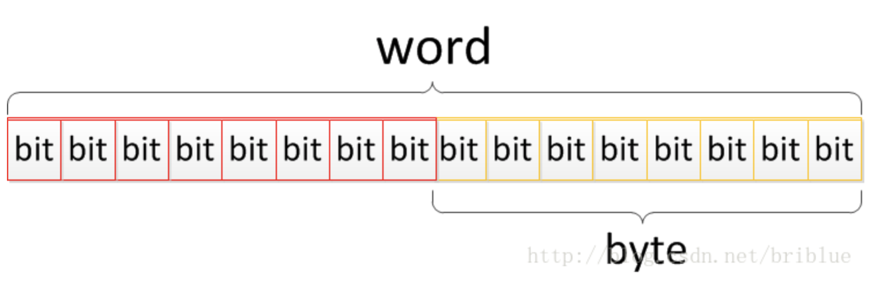

数字 10 的各位进制形式表现如下

- 二进制：1010
- 八进制：012
- 十进制：10
- 十六进制：0x0a

1. bit (位) bit 电脑记忆体中最小的单位，在二进位电脑系统中，每一 bit 可以代表 0 或 1 的数位讯号。所以它能表示的数字范围就是 0 ~ 1。
2. byte (字节) 一个 byte 由 8 bit 组成，所以理论上一个 byte 能表示的数据范围是 0 ~ 255。
3. word (字) 一个 word 由 2 byte 组成，所以理论上一个 word 能表示的数据范围是 0 ~ 65535。

如图：



32 位与 64 位操作系统。

一般计算机设备上，CPU 主要有 32 位和 64 位（当然，单片机有 8 位和 16 位），32 位 CPU 能够寻址的范围是 4 GB。所以过去的电脑设备内存最高一般只能到达 4 GB。后来，随着芯片技术的发展，越来越多的机器采用了 64 位 CPU。这使得机器的最大内存可以为 16 GB。

严格计算的话 2^64 = 2^4 * 2^30* 2^30 = 16 * 2^30 * G = 16 E（B）（G往上3个数量级，G—T—E），就目前的内存大小而言几乎是无限的，但是限于制造水平和操作系统的支持，普通pc一般只支持到16G

那么好，我们再来谈谈 32 位操作系统与 64 位操作系统。实际上它们分别是针对 CPU 类型设计的软件系统。

32 bit 是 4 byte。通常一条 CPU 指令是 4 byte。在 32 位操作系统上，如果一条 CPU 指令是 4 byte，那么 CPU 执行一次能够读取 32 bit 内容，所以一个指令周期内就能够完成指令，如果一条 CPU 指令是 8 byte 的话，那么 32 位操作系统就需要通过 2 个指令周期才能完成指令的读取，而对应的 64 位操作系统因为一次能够读取 64 bit 内容，所以它在一个指令周期就能够读取指令。所以，理论上，64 位的操作系统是要比 32 位操作系统要快 1 倍。

但还有几个需要大家注意的地方是：
1. 64 位 CPU 机器可以安装 32 位操作系统，但效率自然跟 32 位操作系统一样。
2. 32 位 CPU 机器也可以安装 64 位操作系统。
3. 64 位 CPU 机器安装 64 位操作系统才最有效率，但跟软件优化也有关系。


JVM 表现下的基础数据字节长度:

- int：4 个字节。
- short：2 个字节。
- long：8 个字节。
- byte：1 个字节。
- float：4 个字节。
- double：8 个字节。
- char：2 个字节。
- boolean：boolean属于布尔类型，在存储的时候不使用字节，仅仅使用 1 位来存储，范围仅仅为0和1，其字面量为true和false。

我们已经知道了一个 int 型数值是 4 个字节。每个字节有 8 位。但对于一个 int 或者其它整数类型如 （long）的数值而言还要注意的是，它的最高位是符号位。

- 最高位为0表示正数。
- 最高位为1表示负数

原码 将一个数字转换成二进制就是这个数值的原码。
```java
int a = 5; //原码  0000 0000 0000 0101
int b = -3;  //原码  1000 0000 0000 0011
```

反码
分两种情况：正数和负数

- 正数 正数的反码就是原码。
- 负数 负数的反码是在原码的基础上，符号位不变 其它位都取反。
```java
// 正数都一样，原/反码  0000 0000 0000 0101
int a = 5;
//原码  1000 0000 0000 0011
//反码  1111 1111 1111 1100
int b = -3;
```

补码
仍然分正数和负数两种情况

- 正数 正数的补码就是原码。
- 负数 负数的补码在反码的基础上加1。

```java
// 正数都一样，原/补码：0000 0000 0000 0101
int a = 5;
//原码  1000 0000 0000 0011
//反码  1111 1111 1111 1100
//补码  1111 1111 1111 1101
int b = -3;
```

位运算符 &、|、~、^、>>、<<

| 符号 | 描述       | 运算规则                                     |
| ---- | ---------- | -------------------------------------------- |
| &    | 与         | 两个位都为 1 时，结果才为 1                  |
| \|   | 或         | 两个位都是 0 时，结果才为 0                  |
| ^    | 异或       | 两个位相同时为 0，相异为 1                   |
| ~    | 取反       | 0 变 1，1 变 0                               |
| <<   | 左移       | 各二进位全部左移若干位，高位丢弃，低位补 0   |
| >>   | 右移       | 各二进位全部右移若干位，对无符号数，高位补 0 |
| >>>  | 无符号右移 | 不论正负,高位均补0                           |


## 常用位操作小技巧
https://www.jianshu.com/p/b677858bc085
下面对位操作的一些常见应用作个总结，有判断奇偶、交换两数、变换符号及求绝对值。这些小技巧应用易记，应当熟练掌握。

### 判断奇偶数
只要根据最未位是 0 还是 1 来决定，为 0 就是偶数，为 1 就是奇数。 因此可以用 if ((a & 1) == 0) 代替 if (a % 2 == 0) 来判断 a 是不是偶数。下面程序将输出 0 到 100 之间的所有偶数：
```java
for (int i = 0; i < 100; i ++) {
    if ((i & 1) == 0) { // 偶数
        System.out.println(i);
    }
}
```

### 交换两数
```java
int a = 1, b = 2;
a ^= b;
b ^= a;
a ^= b;

System.out.println("a  = " + a);
System.out.println("b = " + b);
```
可以这样理解：

- 第一步 a ^= b 即 a = (a ^ b)；
- 第二步 b ^= a 即 b= b ^ ( a ^ b)，由于异或运算满足交换律，b ^ ( a ^ b) = b ^ b ^ a。由于**一个数和自己异或的结果为 0** 并且**任何数与 0 异或都会不变的**，所以此时 b 被赋上了 a 的值；
- 第三步 a ^= b 就是 a = a ^ b，由于前面二步可知 a = ( a ^ b)，b=a，所以 a = a ^ b 即 a = ( a ^ b ) ^ a。故 a 会被赋上 b 的值。


位运算符包含与运算符、或运算符、取反运算符、异或运算符、左移运算符和右移运算符。在下面的内容中，我将会一一讲解。

需要注意的是，下面测试用的数据都是 int 类型，int 类型是 4 个字节长度，但是为了方便说明示例中用的数值我都用 1 个字节表示。希望不会给大家造成困扰。

& 与运算符

规则 与运算时，进行运算的两个数，从最低位到最高位，一一对应。如果某 bit 的两个数值对应的值都是 1，则结果值相应的 bit 就是 1，否则为 0.
相当于两边相同则为1，否则为0
```java
// 0000 & 0000 = 0000
0 & 0 = 0,
// 0000 & 0001 = 0000
0 & 1 = 0,
// 0001 & 0001 = 0001
1 & 1 = 1
```

3 & 5 = 1 这是因为
```java
0000 0011
&
0000 0101
=
0000 0001
```
按照规则，将两个数值按照低位到高位一一对齐运算，因为只有第 0 位都为 1，所以计算结果为 1.

\| 或运算符

规则 或运算时，进行运算的两个数，从最低位到最高位，一一对应。如果某 bit 的两个数值对应的值只要 1 个为 1，则结果值相应的 bit 就是 1，否则为 0。
相当于两边不同为1，否则为0
```java
// 0000 | 0000 = 0000
0 | 0 = 0,
// 0000 | 0001 = 0001
0 | 1 = 1,
// 0001 | 0001 = 0001
1 | 1 = 1
```

3 | 5 = 7 这是因为
```java
0000 0011
|
0000 0101
=
0000 0111
```

~ 取反运算符

规则 对操作数的每一位进行操作，1 变成 0，0 变成 1。
相当于取反
```java
~5 =>  0000 0101   ~  => 1111 1010
```

^ 异或运算符

规则 两个操作数进行异或时，对于同一位上，如果数值相同则为 0，数值不同则为 1。
```java
// 0001 ^ 0000 = 0001
1 ^ 0 = 1,
// 0001 ^ 0001 = 0000
1 ^ 1 = 0,
// 0000 ^ 0000 = 0000
0 ^ 0 = 0;
```

3 ^ 5 = 6,这是因为
```java
0000 0011
|
0000 0101
=
0000 0110
```

值得注意的是 3 ^ 5 = 6,而 6 ^ 5 = 3
```java
0000 0110
|
0000 0101
=
0000 0011
```

针对这个特性，我们可以将异或运算作为一个简单的数据加密的形式。比如，将一个mp4文件所有数值与一个种子数值进行异或得到加密后的数据，解密的时候再将数据与种子数值进行异或一次就可以了。

所以说异或运算可以作为简单的加解密运算算法。

>> 右移运算符

规则 a >> b 将数值 a 的二进制数值从 0 位算起到第 b - 1 位，整体向右方向移动 b 位，符号位不变，高位空出来的位补数值 0。
```java
5 >> 1 ===>  1000 0000 0000 0101 >> 1  = 1000 0000 0000 0010 = 2
7 >> 2 ===>  1000 0000 0000 0111 >> 2  = 1000 0000 0000 0001 = 1
9 >> 3 ===>  1000 0000 0000 1001 >> 3  = 1000 0000 0000 0001 = 1
11 >> 2 ===> 1000 0000 0000 1011 >> 2 = 1000 0000 0000 0010 = 2
```
大家发现什么规律没有？a >> b = a / ( 2 ^ b ) ,所以 5 >> 1= 5 / 2 = 2,11 >> 2 = 11 / 4 = 2

<< 左移运算符

规则 a << b 将数值 a 的二进制数值从 0 位算起到第 b - 1 位，整体向左方向移动 b 位，符号位不变，低位空出来的位补数值 0。
```java
5 << 1 ===>  1000 0000 0000 0101 << 1  = 1000 0000 0000 1010 = 10
7 << 2 ===>  1000 0000 0000 0111 << 2  = 1000 0000 0001 1100 = 28
9 << 3 ===>  1000 0000 0000 1001 << 3  = 1000 0000 0100 1000 = 72
11 << 2 ===> 1000 0000 0000 1011 << 2 = 1000 0000 0010 1100 = 44
```
