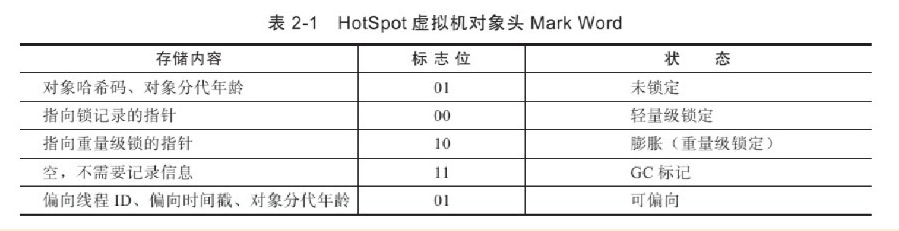
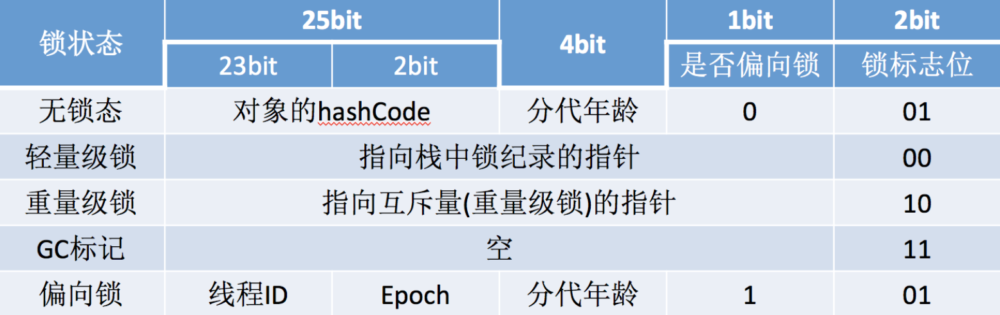

> java对象模型是指java对象在JVM中的模型

# 对象的内存布局

在HotSpot虚拟机中，**_对象(实例)_** 在内存中存储的布局可以分为3块区域：**_对象头（Header）、实例数据（InstanceData）和对齐填充（Padding）_**。

> **对象的实例（instantOopDesc)保存在堆上，对象的元数据（instantKlass）保存在方法区，对象的引用保存在栈上。**

## 对象头

每一个Java类，在被JVM加载的时候，JVM会给这个类创建一个`instanceKlass`，保存在方法区，用来在JVM层表示该Java类。当我们在Java代码中，使用new创建一个对象的时候，JVM会创建一个`instanceOopDesc`对象，这个对象中包含了两部分信息，`MarkWord`以及`类型指针`(**类元数据的指针，也可称为`元数据(Klass Pointer)`**)。
- `MarkWord`中有一些运行时数据，其中就包括和多线程相关的锁的信息。
- `元数据(Klass Pointer)`其实维护的是指针，指向的是对象所属的类的instanceKlass。

> oop-klass model: [java对象在jvm中的模型][a02a9c09]

  [a02a9c09]: https://www.hollischuang.com/archives/1910 "java对象在jvm中的模型"

### MarkWord

_用于存储对象自身的运行时数据_，如哈希码（HashCode）、GC分代年龄、锁状态标志、线程持有的锁、偏向线程ID、偏向时间戳等，这部分数据的长度在32位和64位的虚拟机（未开启压缩指针）中分别为32bit和64bit，官方称它为"`MarkWord`"。





_同样，在HotSpot的源码中我们可以找到关于对象头对象的定义，会一一印证上图的描述。对应与[markOop.hpp][8b27339f]类。_
```java
enum {  age_bits                 = 4,
        lock_bits                = 2,
        biased_lock_bits         = 1,
        max_hash_bits            = BitsPerWord - age_bits - lock_bits - biased_lock_bits,
        hash_bits                = max_hash_bits > 31 ? 31 : max_hash_bits,
        cms_bits                 = LP64_ONLY(1) NOT_LP64(0),
        epoch_bits               = 2
};
```
源码中（markOop.hpp）关于对象头对象的定义，主要包含了 GC 分代年龄、锁状态标记、哈希码、epoch（偏向时间戳）等信息。


**对象的状态一共有五种，分别是无锁态、轻量级锁、重量级锁、GC标记和偏向锁**
[markOop.hpp][8b27339f]类中有关于对象状态的定义：
```java
enum {
        locked_value             = 0, // 00  轻量级锁
        unlocked_value           = 1, // 001 无锁
        monitor_value            = 2, // 10  监视器锁，膨胀锁，重量级锁
        marked_value             = 3, // 11  GC标记
        biased_lock_pattern      = 5  // 101 偏向锁
};
```

`MarkWord`被设计成一个非固定的数据结构以便在极小的空间内存储尽量多的信息，它会根据对象的状态复用自己的存储空间。

例如，在32位的HotSpot虚拟机中，如果对象处于未被锁定的状态下，那么MarkWord的32bit空间中的25bit用于存储对象哈希码，4bit用于存储对象分代年龄，2bit用于存储锁标志位，1bit固定为0，而在其他状态（轻量级锁定、重量级锁定、GC标记、可偏向）下对象的存储内容见上图。

### 元数据(Klass Pointer)

**类型指针(Klass Pointer)，即 _对象指向它的类元数据的指针_，虚拟机通过这个指针来确定这个对象是哪个类的实例。**

并不是所有的虚拟机实现都必须在对象数据上保留类型指针，换句话说，查找对象的元数据信息并不一定要经过对象本身。

具体是指对象的访问方式，目前主流的访问方式有使用句柄和直接指针两种。

不管是句柄还是直接指针，都会存储**对象实例数据的指针**和**对象类型数据的指针**。这就是 _对象指向它的类元数据的指针_。

## 以下只做简单介绍

HotSpot是基于c++实现，而c++是一门面向对象的语言，本身是具备面向对象基本特征的，所以Java中的对象表示，最简单的做法是为每个Java类生成一个c++类与之对应。但HotSpot JVM并没有这么做，而是设计了一个OOP-Klass Model。OOP（Ordinary Object Pointer）指的是普通对象指针，而Klass用来描述对象实例的具体类型。

**在Java程序运行过程中，每创建一个新的对象，在JVM内部就会相应地创建一个对应类型的OOP对象。**

```c++
class oopDesc {
  friend class VMStructs;
 private:
  volatile markOop  _mark;
  union _metadata {
    wideKlassOop    _klass;
    narrowOop       _compressed_klass;
  } _metadata;
}
```

- **_mark** 即`MarkWord`

关于锁标记、GC分代等信息均保存在_mark中

- **_metadata** 即`元数据`

其中_klass是普通指针，_compressed_klass是压缩类指针。这两个指针都指向instanceKlass对象，它用来描述对象的具体类型。

---
参考文章：
- 深入理解java虚拟机
- [深入理解多线程（二）—— Java的对象模型][2ab95416]

    [8b27339f]: https://github.com/openjdk-mirror/jdk7u-hotspot/blob/50bdefc3afe944ca74c3093e7448d6b889cd20d1/src/share/vm/oops/markOop.hpp "markOop.hpp"
  [2ab95416]: https://www.hollischuang.com/archives/1910 "深入理解多线程（二）—— Java的对象模型"
