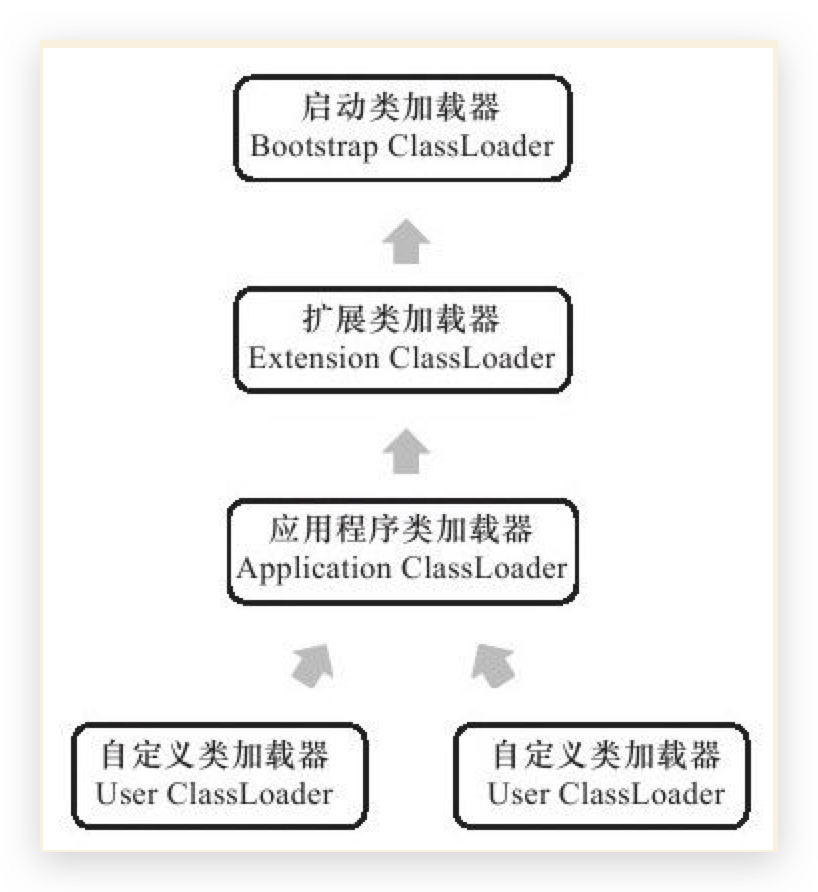
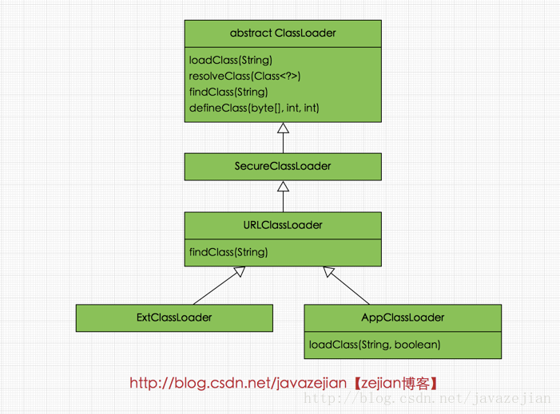

# JVM中类加载器关系



> 虚拟机一启动，会先做一些初始化的动作。
> 一旦初始化动作完成之后，就会产生第一个类加载器，即所谓的Bootstrap Loader，Bootstrap Loader 是由C++ 所撰写而成，这个Bootstrap Loader所做的初始工作中，除了也做一些基本的初始化动作之外，最重要的就是加载定义在sun.misc 命名空间底下的Launcher.java 之中的ExtClassLoader( 因为是inner class ，所以编译之后会变成Launcher$ExtClassLoader.class) ，并设定其Parent 为null，代表其父加载器为Bootstrap Loader 。然后Bootstrap Loader ,再要求加载定义于sun.misc 命名空间底下的Launcher.java 之中的AppClassLoader( 因为是inner class，所以编译之后会变成Launcher$AppClassLoader.class) ，并设定其Parent 为之前产生的ExtClassLoader 实例。

- `bootstrap class loader` 加载`<JAVA_HOME>/lib`路径下的核心类库或`-Xbootclasspath`参数指定的路径下的jar包加载到内存中，注意必由于虚拟机是按照文件名识别加载jar包的，如rt.jar，如果文件名不被虚拟机识别，即使把jar包丢到lib目录下也是没有作用的(出于安全考虑，Bootstrap启动类加载器只加载包名为java、javax、sun等开头的类)。
- `extension class loader` `Launcher`的静态内部类，它负责加载`<JAVA_HOME>/lib/ext`目录下或者由系统变量-`Djava.ext.dir`指定位路径中的类库，开发者可以直接使用标准扩展类加载器。
- `app class loader` 它负责加载系统类路径`java -classpath`或`-D java.class.path` 指定路径下的类库，也就是我们经常用到的`classpath`路径，开发者可以直接使用系统类加载器，一般情况下该类加载是程序中默认的类加载器，通过`ClassLoader#getSystemClassLoader()`方法可以获取到该类加载器。

## 双亲委派模型
双亲委派模型要求除了顶层的启动类加载器外，其余的类加载器都应当有自己的父类加载器，**请注意双亲委派模型中的父子关系并非通常所说的类继承关系，而是采用组合关系来复用父类加载器的相关代码**

### 双亲委派模型优势
> 使用双亲委派模型来组织类加载器之间的关系，有一个显而易见的好外就是Java类随着它的类加载器一起具备了一种带有优先级的层次关系。例如类`java.lang.Object`，它存入在`rt.jar`之中，无座哪一个类加载器要加载这个类，最终都是委派给qhgf模型最顶端的启动类加载器进行加载，因此`Object`类在程序的各种类加载器环境中都是同一个类。
> 相反，如果没有使用双亲委派模型，由和哪个类加载器自行去加载的话，如果用户自己编写了一个称为`java.lang.Object`的类，并入在程序的`classpath`中，那系统中暗疮针会出现多个不同的`Object`类，`Java`类型体系中最基础的行为也就无法保证，应用程序也将会变得一片混乱。

### 双亲委派模型执行逻辑
1. 实现自定义类加载器，继承自`URLClassLoader`，父类加载器为`Launcher$AppClassLoader`
2. 初始化自定义类加载器，通过`URLClassLoader`构造函数`URLClassLoader(URL[] urls, ClassLoader parent)`初始化，把`url`路径信息和父类加载器，传递给`URLClassLoader`
    ```java
    public URLClassLoader(URL[] urls, ClassLoader parent) {
        super(parent);
        // this is to make the stack depth consistent with 1.1
        SecurityManager security = System.getSecurityManager();
        if (security != null) {
            security.checkCreateClassLoader();
        }
        this.acc = AccessController.getContext();
        ucp = new URLClassPath(urls, acc);
    }
    ```
3. 当加载类时，调用`getClassLoder.loadClass("className")`实现加载，默认就会实现`双亲委派模型`
    1. 调用`loadClass("className")`默认会调用`ClassLoader`的实现（可以查看下面的`loadClass(String)`）
        1. 首先检查是类否存在，不存在则父类加载器存在，则通过父类加载类；否则委托给启动加载器去加载
        2. 加载成功，返回类信息
        3. 加载失败，通过子类的`findClass()`方法，查找类，找到则调用`defineClass()`，返回类信息
        4. `findClass()`加载类失败，则返回给自定义类加载器，自己加载类信息

### java中类加载器关系


**实际加载类的逻辑都在`URLClassLoader`的`findClass()`方法中**
- `loadClass(String)`
    - 该方法加载指定名称（包括包名）的二进制类型，该方法在JDK1.2之后不再建议用户重写但用户可以直接调用该方法，`loadClass()`方法是`ClassLoader`类自己实现的，该方法中的逻辑就是双亲委派模式的实现，其源码如下，`loadClass(String name, boolean resolve)`是一个重载方法，`resolve`参数代表是否生成`class`对象的同时进行解析相关操作。
    ```java
    protected Class<?> loadClass(String name, boolean resolve)
          throws ClassNotFoundException
      {
          synchronized (getClassLoadingLock(name)) {
              // 先从缓存查找该class对象，找到就不用重新加载
              Class<?> c = findLoadedClass(name);
              if (c == null) {
                  long t0 = System.nanoTime();
                  try {
                      if (parent != null) {
                          //如果找不到，则委托给父类加载器去加载
                          c = parent.loadClass(name, false);
                      } else {
                          //如果没有父类，则委托给启动加载器去加载
                          c = findBootstrapClassOrNull(name);
                      }
                  } catch (ClassNotFoundException e) {
                      // ClassNotFoundException thrown if class not found
                      // from the non-null parent class loader
                  }

                  if (c == null) {
                      // If still not found, then invoke findClass in order
                      // 如果都没有找到，则通过自定义实现的findClass去查找并加载
                      // findClass在子类URLClassLoader中实现
                      c = findClass(name);

                      // this is the defining class loader; record the stats
                      sun.misc.PerfCounter.getParentDelegationTime().addTime(t1 - t0);
                      sun.misc.PerfCounter.getFindClassTime().addElapsedTimeFrom(t1);
                      sun.misc.PerfCounter.getFindClasses().increment();
                  }
              }
              if (resolve) {//是否需要在加载时进行解析
                  resolveClass(c);
              }
              return c;
          }
      }
    ```
    - 一般自定义`classLoader`时，都会指定父类加载器，即`parentClassLoader`，通过`URLClassLoader`的构造函数，把`parentClassLoader`传递给`ClassLoader`类。
    - 正如`loadClass`方法所展示的，当类加载请求到来时，先从缓存中查找该类对象，如果存在直接返回，如果不存在则交给该类加载器的父加载器去加载，倘若没有父加载器则交给顶级启动类加载器去加载，最后倘若仍没有找到，则使用`findClass()`方法去加载（**关于`findClass()`稍后会进一步介绍**）。
    - 从`loadClass`实现也可以知道如果不想重新定义加载类的规则，也没有复杂的逻辑，只想在运行时加载自己指定的类，那么我们可以直接使用`this.getClass().getClassLoder.loadClass("className")`，这样就可以直接调用`ClassLoader`的`loadClass`方法获取到`class`对象。
- `findClass(String)`
    - 在`JDK1.2`之前，在自定义类加载时，总会去继承`ClassLoader`类并重写`loadClass()`方法，从而实现自定义的类加载类，但是在`JDK1.2`之后已不再建议用户去覆盖l`oadClass()`方法，而是建议把自定义的类加载逻辑写在`findClass()`方法中，从前面的分析可知，`findClass()`方法是在`loadClass()`方法中被调用的，当`loadClass()`方法中父加载器加载失败后，则会调用自己的`findClass()`方法来完成类加载，这样就可以保证自定义的类加载器也符合双亲委托模式。需要注意的是`ClassLoader`类中并没有实现`findClass()`方法的具体代码逻辑，取而代之的是抛出`ClassNotFoundException`异常，同时应该知道的是`findClass()`方法通常是和`defineClass()`方法一起使用的(稍后会分析)，`findClass()`方法是由`URLClassLoader`实现的，源码如下：
    ```java
    /**
     * 从URL搜索中查找并加载具有指定名称的类
     * 路径。任何引用JAR文件的url都将根据需要加载和打开
     * 直到找到类为止。
     * @type {[Class<?>]}
     */
    protected Class<?> findClass(final String name)
        throws ClassNotFoundException
    {
        final Class<?> result;
        try {
            result = AccessController.doPrivileged(
                new PrivilegedExceptionAction<Class<?>>() {
                    public Class<?> run() throws ClassNotFoundException {
                        String path = name.replace('.', '/').concat(".class");
                        // ucp为构造方法传递的url路径信息
                        Resource res = ucp.getResource(path, false);
                        if (res != null) {
                            try {
                                return defineClass(name, res);
                            } catch (IOException e) {
                                throw new ClassNotFoundException(name, e);
                            }
                        } else {
                            return null;
                        }
                    }
                }, acc);
        } catch (java.security.PrivilegedActionException pae) {
            throw (ClassNotFoundException)
            pae.getException();
        }
        if (result == null) {
            throw new ClassNotFoundException(name);
        }
        return result;
    }
    ```
- `defineClass(byte[] b, int off, int len)`
    - defineClass()方法是用来将byte字节流解析成JVM能够识别的Class对象(ClassLoader中已实现该方法逻辑)，通过这个方法不仅能够通过class文件实例化class对象，也可以通过其他方式实例化class对象，如通过网络接收一个类的字节码，然后转换为byte字节流创建对应的Class对象，defineClass()方法通常与findClass()方法一起使用，一般情况下，在自定义类加载器时，会直接覆盖ClassLoader的findClass()方法并编写加载规则，取得要加载类的字节码后转换成流，然后调用defineClass()方法生成类的Class对象，简单例子如下：
    ```java
    protected Class<?> findClass(String name) throws ClassNotFoundException {
        // 获取类的字节数组
        byte[] classData = getClassData(name);
        if (classData == null) {
          throw new ClassNotFoundException();
        } else {
          //使用defineClass生成class对象
          return defineClass(name, classData, 0, classData.length);
        }
    }
    ```
- `resolveClass(Class≺?≻ c)`
    - 使用该方法可以使用类的Class对象创建完成也同时被解析。前面我们说链接阶段主要是对字节码进行验证，为类变量分配内存并设置初始值同时将字节码文件中的符号引用转换为直接引用。

参考文章：
- 深入理解java虚拟机
- https://www.cnblogs.com/dongguacai/p/5879931.html
- https://www.iteye.com/blog/zhuyuehua-916716
- https://blog.csdn.net/javazejian/article/details/73413292
