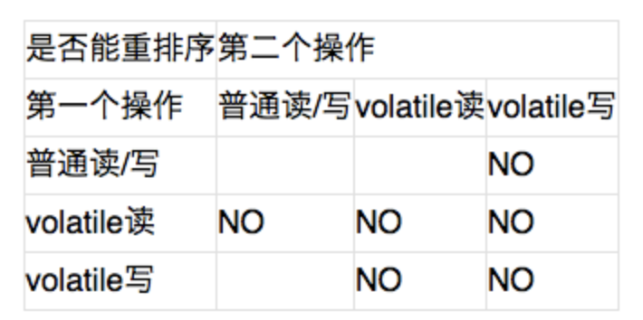

# volatile内存语义
关键字`volatile`可以说是`Java虚拟机`提供的最轻量级的同步机制，当一个变量定义为`volatile`之后，它将具备两种特性：

- 保证此变量对所有线程的可见性，这里的“可见性”是指当一条线程修改了这个变量的值，新值对于其他线程来说是可以立即得知的。
- 禁止指令重排序优化。

# 可见性

## 缓存一致性协议

**缓存一致性协议：** 每个处理器通过嗅探在总线上传播的数据来检查自己缓存的值是不是过期了，当处理器发现自己缓存行对应的内存地址被修改，就会将当前处理器的缓存行设置成无效状态，当处理器要对这个数据进行修改操作的时候，会强制重新从系统内存里把数据读到处理器缓存里。

即，如果一个变量被`volatile`所修饰的话，在每次数据变化之后，其值都会被强制刷入主存。而其他处理器的缓存由于遵守了缓存一致性协议，也会把这个变量的值从主存加载到自己的缓存中(_例如，线程A修改一个普通变量的值，然后向主内存进行回写，另外一条线程B在线程A回写完成了之后再从主内存进行读取操作，新变量值才会对线程B可见。_)。这就保证了一个`volatile`在并发编程中，其值在多个缓存中是可见的。

## volatile与可见性
可见性是指当多个线程访问同一个变量时，一个线程修改了这个变量的值，其他线程能够立即看得到修改的值。

Java中的`volatile`关键字提供了一个功能，那就是被其修饰的变量在被修改后可以立即同步到主内存，被其修饰的变量在每次使用之前都从主内存刷新。因此，可以使用`volatile`来保证多线程操作时变量的可见性。

> 而普通变量不能做到这一点，普通变量的值在线程间传递均需要通过主内存来完成，例如，线程A修改一个普通变量的值，然后向主内存进行回写，另外一条线程B在线程A回写完成了之后再从主内存进行读取操作，新变量值才会对线程B可见。

`volatile`变量在各个线程的工作内存中不存在一致性问题（_在各个线程的工作内存中，`volatile`变量也可以存在不一致的情况，但由于每次使用之前都要先刷新，执行引擎看不到不一致的情况，因此可以认为不存在一致性问题_），**但是Java里面的运算并非原子操作，导致`volatile`变量的运算在并发下一样是不安全的，我们可以通过一段简单的演示来说明原因**

```java
public class VolatileTest{
    public static volatile int race=0;
    public static void increase(){
        race++;
    }
    private static final int THREADS_COUNT=20;
}
```

发起20个线程，每个线程对`race`变量进行10000次自增操作，会发现每次运行程序，输出的结果都不一样，都是一个小于200000的数字，这是为什么呢？

问题就出现在自增运算"`race++`"之中，我们用Javap反编译这段代码后会得到如下代码清单，发现只有一行代码的`increase()`方法在`Class`文件中是由4条字节码指令构成的（return指令不是由`race`产生的，这条指令可以不计算）， **从字节码层面上很容易就分析出并发失败的原因了：当getstatic指令把race的值取到操作栈顶时，`volatile`关键字保证了`race`的值在此时是正确的，但是在执行`iconst_1`、`iadd`这些指令的时候，其他线程可能已经把`race`的值加大了，而在操作栈顶的值就变成了过期的数据，所以`putstatic`指令执行后就可能把较小的`race`值同步回主内存之中。**

**volatile是不能保证原子性的。**

由于`volatile`变量只能保证可见性，在不符合以下两条规则的运算场景中，我们仍然要通过加锁（使用`synchronized`或`java.util.concurrent`中的原子类）来保证原子性。

- 运算结果并不依赖变量的当前值，或者能够确保只有单一的线程修改变量的值。
- 变量不需要与其他的状态变量共同参与不变约束。

# 指令重排序优化

指令重排序是并发编程中最容易让开发人员产生疑惑的地方，举一个可以实际操作运行的例子来分析`volatile`关键字是如何禁止指令重排序优化的。

## 内存屏障
**内存屏障（Memory Barrier）** 是一类同步屏障指令，是CPU或编译器在对内存随机访问的操作中的一个同步点，使得此点之前的所有读写操作都执行后才可以开始执行此点之后的操作。也就是说通过插入内存屏障禁止在内存屏障前后的指令执行重排序优化。



从上表我们可以看出：
> 当第二个操作是volatile写时，不管第一个操作是什么，都不能重排序。这个规则确保volatile写之前的操作不会被编译器重排序到volatile写之后。
>
> 当第一个操作是volatile读时，不管第二个操作是什么，都不能重排序。这个规则确保volatile读之后的操作不会被编译器重排序到volatile读之前。
>
> 当第一个操作是volatile写，第二个操作是volatile读时，不能重排序。

所以，`volatile`通过在`volatile`变量的操作前后插入`内存屏障`的方式，来禁止指令重排，进而保证多线程情况下对共享变量的有序性。


- DCL单例模式
```java
public class Singleton{
    private volatile static Singleton instance;
    public static Singleton getInstance(){
        if（instance==null）{
            synchronized（Singleton.class）{
                if（instance==null）{
                    instance=new Singleton();
                }
            }
        }
        return instance;
    }
    public static void main（String[] args）{
        Singleton.getInstance();
    }
}
```

观察加入`volatile`和未加入`volatile`关键字时所生成汇编代码的差别。

编译后，这段代码对instance变量赋值部分如下所示。
```basic
0x01a3de0f:mov$0x3375cdb0，%esi;……beb0cd7533;{oop（'Singleton'）}
0x01a3de14:mov%eax，0x150（%esi）;……89865001 0000
0x01a3de1a:shr$0x9，%esi;……c1ee09
0x01a3de1d:movb$0x0，0x1104800（%esi）;……c6860048 100100
0x01a3de24:lockaddl$0x0，（%esp）;……f0830424 00
;*putstatic instance
;-
Singleton:getInstance@24
```

通过对比就会发现，关键变化在于有`volatile`修饰的变量，赋值后（前面`mov%eax，0x150（%esi）`这句便是赋值操作）多执行了一个“`lockaddl＄0x0，（%esp）`”操作，这个操作相当于一个`内存屏障`（_MemoryBarrier或MemoryFence，指重排序时不能把后面的指令重排序到内存屏障之前的位置_），只有一个CPU访问内存时，并不需要内存屏障；但如果有两个或更多CPU访问同一块内存，且其中有一个在观测另一个，就需要内存屏障来保证一致性了。这句指令中的“`addl＄0x0，（%esp）`”（把ESP寄存器的值加0）显然是一个空操作（采用这个空操作而不是空操作指令nop是因为IA32手册规定lock前缀不允许配合nop指令使用），关键在于`lock`前缀，查询IA32手册，它的作用是使得本CPU的Cache写入了内存，该写入动作也会引起别的CPU或者别的内核无效化（Invalidate）其Cache，这种操作相当于对Cache中的变量做了一次前面介绍Java内存模式中所说的“store和write”操作。所以通过这样一个空操作，可让前面`volatile`变量的修改对其他CPU立即可见。

- 不加`volatile`时

这段代码在单线程环境下并没有什么问题，但如果在多线程环境下就可以出现线程安全问题。原因在于某一个线程执行到第一次检测，读取到的`instance`不为`null`时，`instance`的引用对象可能没有完成初始化。因为`nstance = new Singleton();`可以分为以下3步完成(伪代码)
```java
memory = allocate(); //1.分配对象内存空间
instance(memory);    //2.初始化对象
instance = memory;   //3.设置instance指向刚分配的内存地址，此时instance！=null
```

由于步骤1和步骤2间可能会重排序，如下： **好像顺序有错，还没有整理**
```java
instance(memory);    //2.初始化对象
memory = allocate(); //1.分配对象内存空间
instance = memory;   //3.设置instance指向刚分配的内存地址，此时instance！=null，但是对象还没有初始化完成！
```

由于步骤2和步骤3不存在数据依赖关系，而且无论重排前还是重排后程序的执行结果在单线程中并没有改变，因此这种重排优化是允许的。但是指令重排只会保证串行语义的执行的一致性(单线程)，但并不会关心多线程间的语义一致性。所以当一条线程访问`instance`不为`null`时，由于`instance`实例未必已初始化完成，也就造成了线程安全问题。那么该如何解决呢，很简单，我们使用`volatile`禁止`instance`变量被执行指令重排优化即可。

---
参考文章：
- 深入理解java虚拟机
- [全面理解Java内存模型(JMM)及volatile关键字][5f424c03]
- [volatile][b90fb761]

  [5f424c03]: https://blog.csdn.net/javazejian/article/details/72772461 "全面理解Java内存模型(JMM)及volatile关键字"
  [b90fb761]: https://www.hollischuang.com/archives/2673 "volatile"
