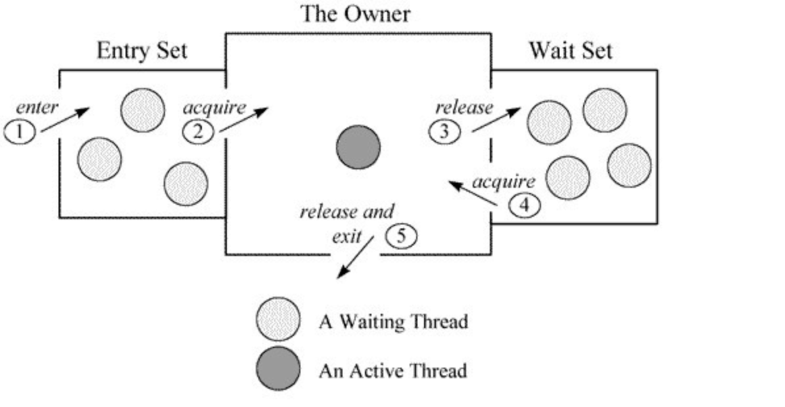

`Monitor`其实是一种同步工具，也可以说是一种同步机制，它通常被描述为一个对象，主要特点是：
> 对象的所有方法都被“互斥”的执行。好比一个Monitor只有一个运行“许可”，任一个线程进入任何一个方法都需要获得这个“许可”，离开时把许可归还。
>
> 通常提供singal机制：允许正持有“许可”的线程暂时放弃“许可”，等待某个谓词成真（条件变量），而条件成立后，当前进程可以“通知”正在等待这个条件变量的线程，让他可以重新去获得运行许可。

在Java虚拟机(HotSpot)中，Monitor是基于C++实现的，由[ObjectMonitor][6c4bed61]实现的，其主要数据结构如下：

```c++
ObjectMonitor() {
    _header       = NULL;
     _count        = 0; // 用来记录该线程获取锁的次数
     _waiters      = 0,
     _recursions   = 0; // 锁的重入次数
     _object       = NULL;
     _owner        = NULL; // 指向持有 ObjectMonitor 对象的线程
     _WaitSet      = NULL; // 存放处于 wait 状态的线程队列
     _WaitSetLock  = 0 ;
     _Responsible  = NULL ;
     _succ         = NULL ;
     _cxq          = NULL ;
     FreeNext      = NULL ;
     _EntryList    = NULL ; // 存放处于等待锁 block 状态的线程队列
     _SpinFreq     = 0 ;
     _SpinClock    = 0 ;
     OwnerIsThread = 0 ;
     _previous_owner_tid = 0;
 }
 ```

当多个线程同时访问一段同步代码时，首先会进入`_EntryList`队列中，当某个线程获取到对象的`monitor`后进入`_Owner`区域并把`monitor`中的`_owner`变量设置为当前线程，同时`monitor`中的计数器`_count`加1。即获得对象锁。

若持有`monitor`的线程调用`wait()`方法，将释放当前持有的`monitor`，`_owner`变量恢复为`null`，`_count`自减1，同时该线程进入`_WaitSet`集合中等待被唤醒。若当前线程执行完毕也将释放`monitor(锁)`并复位变量的值，以便其他线程进入获取`monitor(锁)`。如下图所示



---
 参考文章：
 - [Java-内存模型 synchronized 的内存语义][6b0b43e9]
 - [深入理解多线程（四）—— Moniter的实现原理][28b123b8]

  [6c4bed61]: https://github.com/openjdk-mirror/jdk7u-hotspot/blob/50bdefc3afe944ca74c3093e7448d6b889cd20d1/src/share/vm/runtime/objectMonitor.cpp "ObjectMonitor"

  [6b0b43e9]: https://www.cnblogs.com/jhxxb/p/10948653.html "Java-内存模型 synchronized 的内存语义"
  [28b123b8]: https://www.hollischuang.com/archives/2030 "深入理解多线程（四）—— Moniter的实现原理"
