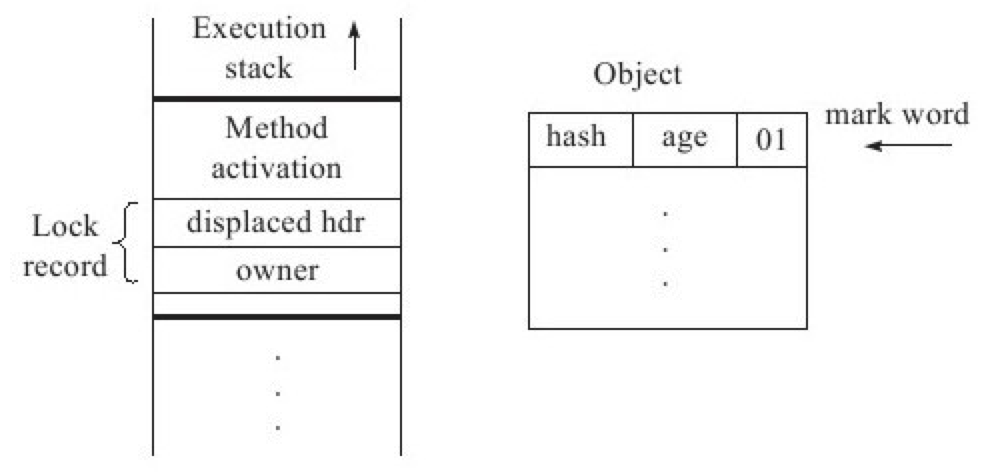
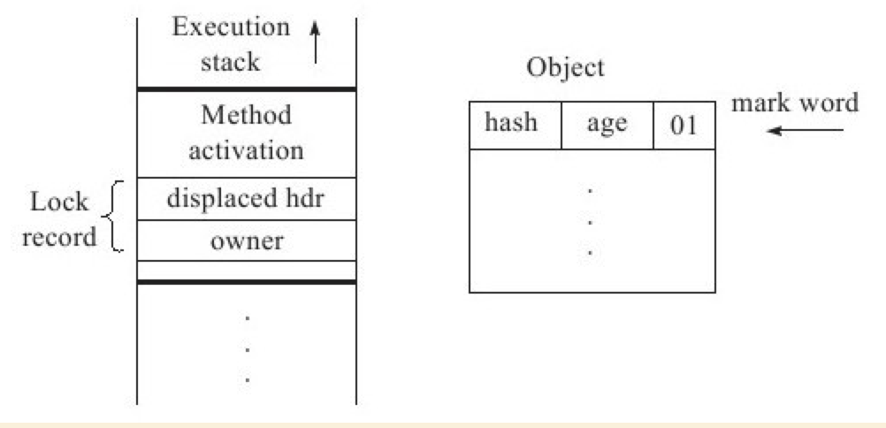

# Java虚拟机对synchronized的优化
> 锁的状态总共有四种，`无锁状态`、`偏向锁`、`轻量级锁`和`重量级锁`。

随着锁的竞争，锁可以从`偏向锁`升级到`轻量级锁`，再升级的`重量级锁`，但是锁的升级是单向的，也就是说只能从低到高升级，不会出现锁的降级。

# 偏向锁
偏向锁也是JDK1.6中引入的一项锁优化，它的目的是消除数据在无竞争情况下的同步原语，进一步提高程序的运行性能。如果说轻量级锁是在无竞争的情况下使用CAS操作去消除同步使用的互斥量，那偏向锁就是在无竞争的情况下把整个同步都消除掉，连CAS操作都不做了。

偏向锁的“偏”，就是偏心的“偏”、偏袒的“偏”，它的意思是这个锁会偏向于第一个获得它的线程，如果在接下来的执行过程中，该锁没有被其他的线程获取，则持有偏向锁的线程将永远不需要再进行同步。

- 原理

假设当前虚拟机启用了偏向锁（启用参数XX:+UseBiasedLocking，这是JDK1.6的默认值），那么，当锁对象第一次被线程获取的时候，虚拟机将会把对象头中的标志位设为“01”，即偏向模式。同时使用CAS操作把获取到这个锁的线程的ID记录在对象的MarkWord之中，如果CAS操作成功，持有偏向锁的线程以后每次进入这个锁相关的同步块时，虚拟机都可以不再进行任何同步操作（例如Locking、Unlocking及对MarkWord的Update等）。

**当有另外一个线程去尝试获取这个锁时，偏向模式就宣告结束。**

根据锁对象目前是否处于被锁定的状态，撤销偏向（RevokeBias）后恢复到未锁定（标志位为“01”）或轻量级锁定（标志位为“00”）的状态




# 轻量级锁
> 轻量级锁是JDK1.6之中加入的新型锁机制，它名字中的“轻量级”是相对于使用操作系统互斥量来实现的传统锁而言的，因此传统的锁机制就称为“重量级”锁。首先需要强调一点的是，轻量级锁并不是用来代替重量级锁的，它的本意是在没有多线程竞争的前提下，减少传统的重量级锁使用操作系统互斥量产生的性能消耗。
>
> **实现方式为：CAS(compare and swap)**

- 执行过程

在代码进入同步块的时候，如果此同步对象没有被锁定（锁标志位为“01”状态），虚拟机首先将在当前线程的栈帧中建立一个名为锁记录（LockRecord）的空间，用于存储锁对象目前的MarkWord的拷贝（官方把这份拷贝加了一个Displaced前缀，即DisplacedMarkWord），这时候线程堆栈与对象头的状态如图所示。



然后，虚拟机将使用CAS操作尝试将对象的`MarkWord`更新为指向`LockRecord`的指针。如果这个更新动作成功了，那么这个线程就拥有了该对象的锁，并且对象`MarkWord`的锁标志位（MarkWord的最后2bit）将转变为“00”，即表示此对象处于轻量级锁定状态，这时候线程堆栈与对象头的状态如图所示。


如果这个更新操作失败了，虚拟机首先会检查对象的MarkWord是否指向当前线程的栈帧，如果只说明当前线程已经拥有了这个对象的锁，那就可以直接进入同步块继续执行，否则说明这个锁对象已经被其他线程抢占了。

**如果有两条以上的线程争用同一个锁，那轻量级锁就不再有效，要膨胀为重量级锁，锁标志的状态值变为“10”，`MarkWord`中存储的就是指向重量级锁（互斥量）的指针，后面等待锁的线程也要进入阻塞状态。**

---

_上面描述的是轻量级锁的加锁过程，它的解锁过程也是通过CAS操作来进行的。_

---

**_轻量级锁能提升程序同步性能的依据是“对于绝大部分的锁，在整个同步周期内都是不存在竞争的”，这是一个经验数据。如果没有竞争，轻量级锁使用`CAS`操作避免了使用互斥量的开销，但如果存在锁竞争，除了互斥量的开销外，还额外发生了`CAS`操作，因此在有竞争的情况下，轻量级锁会比传统的重量级锁更慢。_**

## 自旋锁
自旋锁的理念是如果线程现在拿不到锁，并不直接陷入阻塞或者释放 CPU 资源，而是开始利用循环，不停地尝试获取锁，这个循环过程被形象地比喻为“自旋”，就像是线程在“自我旋转”。

**自旋锁实现方式为CAS(compare and swap)**

自旋等待的时间必须要有一定的限度，如果自旋超过了限定的次数仍然没有成功获得锁，就应当使用传统的方式去挂起线程了。自旋次数的默认值是10次，用户可以使用参数XX:PreBlockSpin来更改。

## 自适应自旋锁
自适应意味着自旋的时间不再固定了，而是由前一次在同一个锁上的自旋时间及锁的拥有者的状态来决定。如果在同一个锁对象上，自旋等待刚刚成功获得过锁，并且持有锁的线程正在运行中，那么虚拟机就会认为这次自旋也很有可能再次成功，进而它将允许自旋等待持续相对更长的时间，比如100个循环。另外，如果对于某个锁，自旋很少成功获得过，那在以后要获取这个锁时将可能省略掉自旋过程，以避免浪费处理器资源。有了自适应自旋，随着程序运行和性能监控信息的不断完善，虚拟机对程序锁的状况预测就会越来越准确，虚拟机就会变得越来越“聪明”了。

# 锁消除
**锁消除是指虚拟机即时编译器在运行时，对一些代码上要求同步，但是被检测到不可能存在共享数据竞争的锁进行消除。**

锁消除的主要判定依据来源于逃逸分析的数据支持，如果判断在一段代码中，堆上的所有数据都不会逃逸出去从而被其他线程访问到，那就可以把它们当做栈上数据对待，认为它们是线程私有的，同步加锁自然就无须进行。

示例：
```java
public String concatString（Strings1，Strings2，Strings3）{
    StringBuffer sb = new StringBuffer();
    sb.append（s1）;
    sb.append（s2）;
    sb.append（s3）;
    returnsb.toString();
}
```
每个StringBuffer.append()方法中都有一个同步块，锁就是sb对象。虚拟机观察变量sb，很快就会发现它的动态作用域被限制在concatString()方法内部。也就是说，sb的所有引用永远不会“逃逸”到concatString()方法之外，其他线程无法访问到它，因此，虽然这里有锁，但是可以被安全地消除掉，在即时编译之后，这段代码就会忽略掉所有的同步而直接执行了。

# 锁粗化
原则上，我们在编写代码的时候，总是推荐将同步块的作用范围限制得尽量小——只在共享数据的实际作用域中才进行同步，这样是为了使得需要同步的操作数量尽可能变小，如果存在锁竞争，那等待锁的线程也能尽快拿到锁。

如果虚拟机探测到有这样一串零碎的操作都对同一个对象加锁，将会把加锁同步的范围扩展（粗化）到整个操作序列的外部，以上图代码为例，就是扩展到第一个append()操作之前直至最后一个append()操作之后，这样只需要加锁一次就可以了。

或者如在循环体中加锁，粗化后，加锁操作就移到循环体外了。
