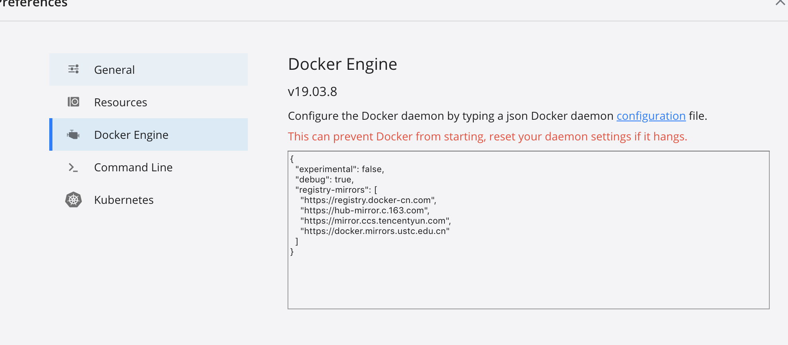

# install docker

`Homebrew` 的 `Cask`(**使用 brew cask 安装 macOS 应用程序、字体和插件以及其他非开源软件**) 已经支持 Docker for Mac，因此可以很方便的使用 `Homebrew Cask` 来进行安装：
```
brew cask install docker
```
安装完成后，可以在 _launcher_ 中看到对应的`docker`图标，点击`docker`图标，运行之后，会在右上角菜单栏看到多了一个鲸鱼图标，这个图标表明了 Docker 的运行状态。


启动终端后，通过命令可以检查安装后的 Docker 版本。
```
baozc@bao-MacBook-Pro  ~  docker --version
Docker version 19.03.8, build afacb8b
baozc@bao-MacBook-Pro  ~  docker-compose --version
docker-compose version 1.25.5, build 8a1c60f6
```

## docker preferences

国内从 Docker Hub 拉取镜像有时会遇到困难，此时可以配置镜像加速器。Docker 官方和国内很多云服务商都提供了国内加速器服务。

### Docker Hub 镜像加速器列表

| 镜像加速器          | 镜像加速器地址                          | 专属加速器？ | 其它加速？            |
| ------------------- | --------------------------------------- | ------------ | --------------------- |
| [Docker 中国官方镜像][704ca45c] | https://registry.docker-cn.com          |              | Docker Hub            |
| [DaoCloud 镜像站][388f1f0e]     | http://f1361db2.m.daocloud.io           |              | Docker Hub            |
| [Azure 中国镜像][d12f1518]      | https://dockerhub.azk8s.cn              |              | Docker Hub、GCR、Quay |
| [科大镜像站 ][1069ae80]         | https://docker.mirrors.ustc.edu.cn      |              | Docker Hub、GCR、Quay |
| [阿里云 ][6d73e7b4]             | https://<your_code>.mirror.aliyuncs.com | 登录分配     | Docker Hub            |
| [七牛云 ][20bb60b4]             | https://reg-mirror.qiniu.com            |              | Docker Hub、GCR、Quay |
| [网易云][69782958]              | https://hub-mirror.c.163.com            |              | Docker Hub            |
| [腾讯云 ][4896f6ce]             | https://mirror.ccs.tencentyun.com       |              | Docker Hub            |

### 配置加速器
preferences - docker engine



设置`registry-mirrors`可配置多个地址

### 检查加速器是否生效
执行`docker info`命令
```
Registry Mirrors:
  https://registry.docker-cn.com/
  https://hub-mirror.c.163.com/
  https://mirror.ccs.tencentyun.com/
  https://docker.mirrors.ustc.edu.cn/
Live Restore Enabled: false
Product License: Community Engine
```
如果看到`Registry Mirrors`里显示配置的信息，则说明配置成功

  [704ca45c]: https://docker-cn.com/registry-mirror "Docker 中国官方镜像"
  [388f1f0e]: https://daocloud.io/mirror "DaoCloud 镜像站"
  [d12f1518]: https://github.com/Azure/container-service-for-azure-china/blob/master/aks/README.md#22-container-registry-proxy "Azure 中国镜像"
  [1069ae80]: https://mirrors.ustc.edu.cn/help/dockerhub.html "科大镜像站"
  [6d73e7b4]: https://cr.console.aliyun.com/ "阿里云"
  [20bb60b4]: https://kirk-enterprise.github.io/hub-docs/#/user-guide/mirror "七牛云"
  [69782958]: https://c.163yun.com/hub "网易云"
  [4896f6ce]: https://cloud.tencent.com/document/product/457/9113 "腾讯云"
