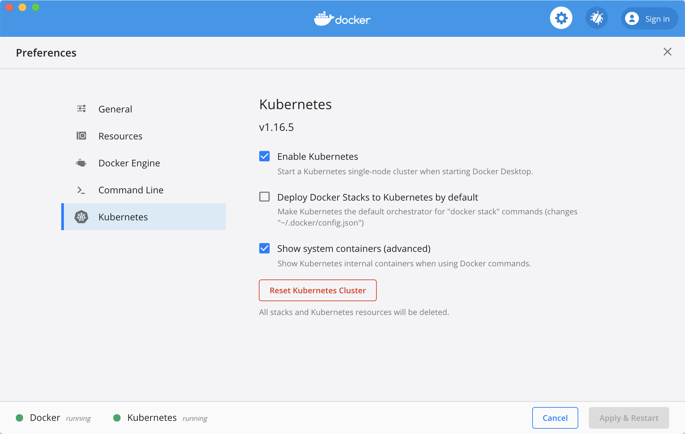
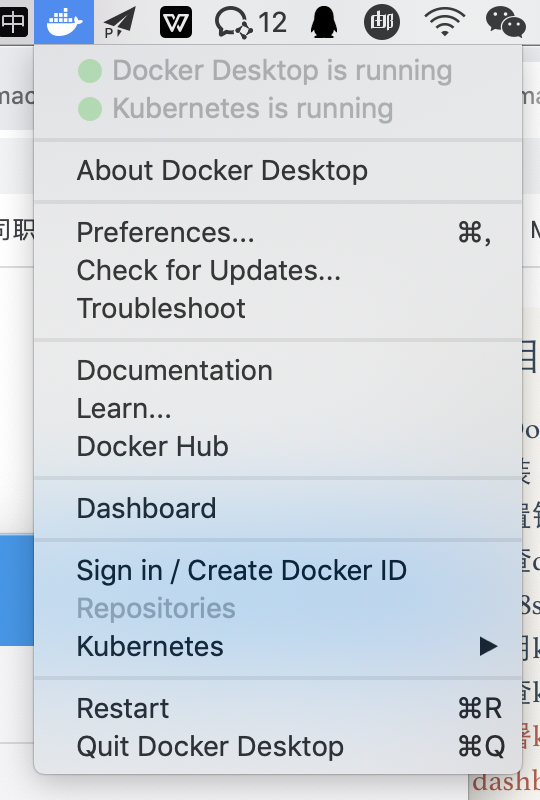
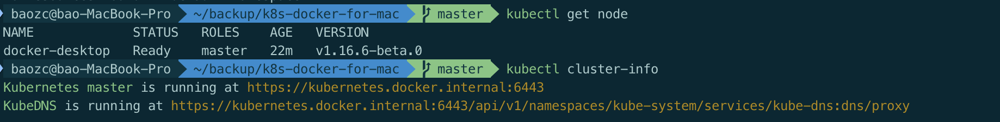
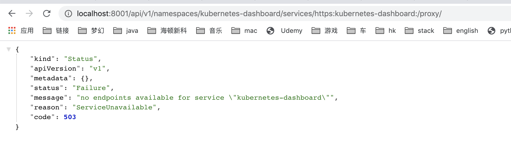
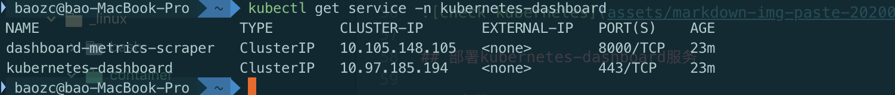
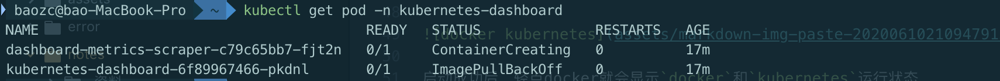
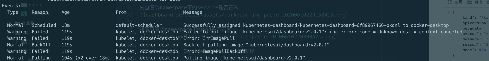
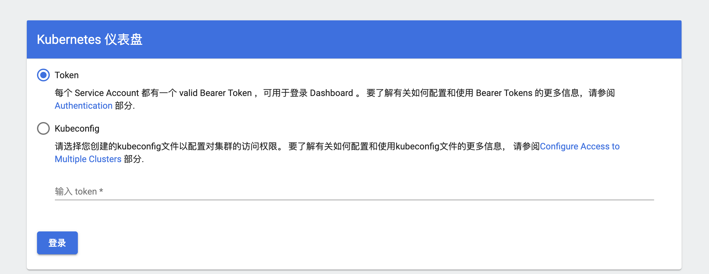

# mac for Kubernetes
了解到的mac安装kubernetes方式

- [Minikube][1400508c]
- [GKE][cf3bf45c]
- [Docker for Mac（Edge）][c967114c]
- [Docker for Windows（Edge）][29ef3034]

[1400508c]: https://kubernetes.io/docs/tasks/tools/install-minikube/ "Minikube"
[cf3bf45c]: https://cloud.google.com/kubernetes-engine/docs/how-to/creating-a-container-cluster "GKE"
[c967114c]: https://docs.docker.com/docker-for-mac/install/ "Docker for Mac（Edge）"
[29ef3034]: https://docs.docker.com/docker-for-windows/install/ "Docker for Windows（Edge）"

最后选择`docker for desktop`

# 基于Docker for macOS的Kubernetes本地环境搭建与应用部署
> 前提：安装了`docker for macOS`，配置了镜像加速

## 为防止启动k8s太慢，可提前下载k8s镜像
由于墙的问题，启动Kubernetes时，一直显示Kubernetes is starting.解决方法参考：https://github.com/maguowei/k8s-docker-for-mac

步骤：
- git clone https://github.com/maguowei/k8s-docker-for-mac.git
- cd k8s-docker-for-mac/
- ../load_images.sh

下载镜像完成后，查看k8s镜像
- docker images

```
baozc@bao-MacBook-Pro  ~/backup  git clone https://github.com/maguowei/k8s-docker-for-mac.git
Cloning into 'k8s-docker-for-mac'...
remote: Enumerating objects: 20, done.
remote: Counting objects: 100% (20/20), done.
remote: Compressing objects: 100% (15/15), done.
remote: Total 233 (delta 6), reused 11 (delta 2), pack-reused 213
Receiving objects: 100% (233/233), 1.03 MiB | 132.00 KiB/s, done.
Resolving deltas: 100% (87/87), done.
baozc@bao-MacBook-Pro  ~/backup/k8s-docker-for-mac   master  sh load_images.sh
baozc@bao-MacBook-Pro  ~/backup/k8s-docker-for-mac   master  docker images
REPOSITORY                           TAG                 IMAGE ID            CREATED             SIZE
k8s.gcr.io/kube-proxy                v1.16.5             0ee1b8a3ebe0        4 months ago        82.7MB
k8s.gcr.io/kube-controller-manager   v1.16.5             441835dd2301        4 months ago        151MB
k8s.gcr.io/kube-scheduler            v1.16.5             b4d073a9efda        4 months ago        83.5MB
k8s.gcr.io/kube-apiserver            v1.16.5             fc838b21afbb        4 months ago        159MB
k8s.gcr.io/etcd                      3.3.15-0            b2756210eeab        9 months ago        247MB
k8s.gcr.io/coredns                   1.6.2               bf261d157914        10 months ago       44.1MB
k8s.gcr.io/pause                     3.1                 da86e6ba6ca1        2 years ago         742kB
```

## 搭建k8s本地开发环境

- 启用k8s
docker - preferences - kubernetes，勾选，稍等一下，就会启动成功。



启动成功后，轻点docker就会显示`docker`和`kubernetes`运行状态



## 检查k8s环境


## 部署kubernetes-dashboard服务

### 安装dashbord pod
接下来，我们需要安装第一个应用，k8s的管理界面，否则我们只有命令行可以用。

k8s的管理界面是一个 [dashboard][bac34ebb]的应用，我们需要部署这个。

To deploy Dashboard, execute following command:
```
kubectl apply -f https://raw.githubusercontent.com/kubernetes/dashboard/v2.0.1/aio/deploy/recommended.yaml
```

#### 临时解决GitHub的raw.githubusercontent.com无法连接问题
- 通过[IPAddress.com][b197e5d9]首页,输入raw.githubusercontent.com查询到真实IP地址
- 修改host, `sudo vim /etc/hosts`
- 添加映射关系，`199.232.68.133 raw.githubusercontent.com`

### 启动 Dashboard
```
kubectl proxy
```
- **访问：**

http://localhost:8001/api/v1/namespaces/kubernetes-dashboard/services/https:kubernetes-dashboard:/proxy/

---
- **出错：503 no endpoints available for service \"kubernetes-dashboard\"**



- **排查：**

首先因为访问的是namespace是`kubernetes-dashboard`

先查看该namespace下的service是否正常


接着查看该namespace下的pod是否正常


发现pod创建失败，通过`describe`查看详情发现，镜像拉取失败


- **解决：**

下载`kubernetes-dashboard-6f89967466-pkdnl` pod缺失的镜像
```
docker pull kubernetesui/dashboard:v2.0.1
```
下载成功后，重启pod

---

- **登录**


#### **获取token**
有一个简单的命令：
```bash
kubectl -n kube-system describe $(kubectl -n kube-system get secret -n kube-system -o name | grep namespace) | grep token
```

也可以自己手动查询：
```bash
# 输入下面命令查询kube-system命名空间下的所有secret
kubectl get secret -n kube-system

# 然后获取token。只要是type为service-account-token的secret的token都可以使用。
# 比如我们获取replicaset-controller-token-wsv4v的touken
kubectl -n kube-system describe replicaset-controller-token-wsv4v
```

- **认证有两种方式：**
    - 通过我们刚刚获取的token直接认证
    - 通过Kubeconfig文件认证，只需要在kubeadm生成的admin.conf文件末尾加上刚刚获取的token就好了
      ```yaml
      - name: kubernetes-admin
        user:
            client-certificate-data: xxxxxxxx
            client-key-data: xxxxxx
            token: "在这里加上token"
      ```

### 修改dashboardk8s-dashboard服务类型为nodePort
开发环境推荐用NodePort的方式访问dashboard，因此编辑一下该部署

- 修改`yaml`文件
    ```bash
    kubectl edit service kubernetes-dashboard -n kubernetes-dashboard
    ```
- 这里将`type: ClusterIP`修改为`type: NodePort`
    ```yaml
    apiVersion: v1
    kind: Service
    metadata:
      annotations:
        kubectl.kubernetes.io/last-applied-configuration: |
          {"apiVersion":"v1","kind":"Service","metadata":{"annotations":{},"labels":{"k8s-app":"kubernetes-dashboard"},"name":"kubernetes-dashboard","namespace":"kubernetes-dashboard"},"spec":{"ports":[{"port":443,"targetPort":8443}],"selector":{"k8s-app":"kubernetes-dashboard"}}}
      creationTimestamp: "2020-06-10T13:38:27Z"
      labels:
        k8s-app: kubernetes-dashboard
      name: kubernetes-dashboard
      namespace: kubernetes-dashboard
      resourceVersion: "10115"
      selfLink: /api/v1/namespaces/kubernetes-dashboard/services/kubernetes-dashboard
      uid: 16ea3aee-144a-42e8-97b2-dfbaab79aeba
    spec:
      clusterIP: 10.97.185.194
      ports:
      - port: 443
        protocol: TCP
        targetPort: 8443
      selector:
        k8s-app: kubernetes-dashboard
      sessionAffinity: None
      type: ClusterIP
    status:
      loadBalancer: {}
    ```

  [bac34ebb]: https://github.com/kubernetes/dashboard "dashboard"
  [b197e5d9]: https://www.ipaddress.com/ "IPAddress.com"
