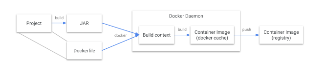
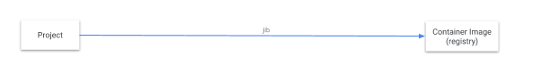

# 谷歌开源 Java 镜像构建工具 Jib
> 容器的出现让 `Java` 开发人员比以往任何时候都更接近“编写一次，到处运行”的工作流程，但要对 `Java` 应用程序进行容器化并非易事：你必须编写 `Dockerfile`，以 `root` 身份运行 `Docker` 守护进程，等待构建完成，最后将镜像推送到远程注册中心。但并非所有的 `Java` 开发人员都是容器专家，像以前那样只需要构建一个 `JAR` 包的日子已经结束了吗？

为了应对这一挑战，谷歌开源了一个 `Java` 容器化工具 **`Jib`**，有了这个工具，`Java` 开发人员可以使用他们熟悉的 `Java` 工具来构建容器。`Jib` 是一个快速而简单的容器镜像构建工具，它负责处理将应用程序打包到容器镜像中所需的所有步骤。它不需要你编写 `Dockerfile` 或安装 `Docker`，而且可以直接集成到 `Maven` 和 `Gradle` 中——只需要将插件添加到构建中，就可以立即将 `Java` 应用程序容器化。

- `docker` 构建流程


- `jib` 构建流程


# [Jib][4dea1531] 如何让开发变得更美好
`jib` 可作为 `Maven` 和 `Gradle` 的插件使用，并且只需要做出最少的配置。只需将插件添加到构建定义中并配置目标镜像即可。如果要将镜像推送到私有注册中心，要为 `Jib` 配置所需的秘钥。最简单的方法是使用 `docker-credential-gcr `之类的凭证助手。`Jib` 还提供了其他的一些规则，用于将镜像构建到 `Docker` 守护进程。

## [maven使用jib插件][2bbfe589]
```xml
<build>
    <plugins>
        <plugin>
            <groupId>com.google.cloud.tools</groupId>
            <artifactId>jib-maven-plugin</artifactId>
            <version>2.4.0</version>
            <configuration>
                <from>
                    <!--从本地docker守护进程拉取镜像-->
                    <image>docker://openjdk:8</image>
                </from>
                <to>
                    <image>baozc/jibtest</image>
                    <!--<credHelper>docker-credential-*</credHelper>-->
                </to>
                <container>
                    <mainClass>cn.baozcc.wx.WxApplication</mainClass>
                    <!--容器创建时间-->
                    <creationTime>USE_CURRENT_TIMESTAMP</creationTime>
                </container>
            </configuration>
        </plugin>
    </plugins>
</build>
```

### 在本地docker环境中构建镜像
```
mvn clean compile jib:dockerBuild
```
输出：
```bash
INFO] Scanning for projects...
[INFO]
[INFO] ------------------------------------------------------------------------
[INFO] Building wx 1.0
[INFO] ------------------------------------------------------------------------
[INFO]
[INFO] --- maven-clean-plugin:3.1.0:clean (default-clean) @ wx ---
[INFO] Deleting /Users/baozc/ideaProjects/base/wx/target
[INFO]
[INFO] --- maven-resources-plugin:3.1.0:resources (default-resources) @ wx ---
[INFO] Using 'UTF-8' encoding to copy filtered resources.
[INFO] Copying 1 resource
[INFO] Copying 4 resources
[INFO]
[INFO] --- maven-compiler-plugin:3.8.1:compile (default-compile) @ wx ---
[INFO] Changes detected - recompiling the module!
[INFO] Compiling 2 source files to /Users/baozc/ideaProjects/base/wx/target/classes
[INFO]
[INFO] --- jib-maven-plugin:2.4.0:dockerBuild (default-cli) @ wx ---
[WARNING] Setting image creation time to current time; your image may not be reproducible.
[INFO]
[INFO] Containerizing application to Docker daemon as baozc/jibtest...
[WARNING] Base image 'openjdk:8' does not use a specific image digest - build may not be reproducible
[INFO]
[INFO] Container entrypoint set to [java, -cp, /app/resources:/app/classes:/app/libs/*, cn.baozcc.wx.WxApplication]
[INFO]
[INFO] Built image to Docker daemon as baozc/jibtest
[INFO] Executing tasks:
[INFO] [==============================] 100.0% complete
[INFO]
[INFO] ------------------------------------------------------------------------
[INFO] BUILD SUCCESS
[INFO] ------------------------------------------------------------------------
[INFO] Total time: 14.765 s
[INFO] Finished at: 2020-06-16T18:01:01+08:00
[INFO] Final Memory: 49M/883M
[INFO] ------------------------------------------------------------------------
```
输出会显示`镜像名称`、`entrypoint`等信息，查看当前镜像
```
baozc/jibtest    latest     964d78e67ee4        17 seconds ago      543MB
```

### 使用远程docker仓库构建
- 401问题没有解决

---
参考文章：
- https://juejin.im/post/5b4e9c316fb9a04fa01d39d6
- https://anjia0532.github.io/2019/09/22/google-jib-alpine-tini/

  [2bbfe589]: https://github.com/GoogleContainerTools/jib/tree/master/jib-maven-plugin "jib plugin"
  [4dea1531]: https://github.com/GoogleContainerTools/jib "jib"
