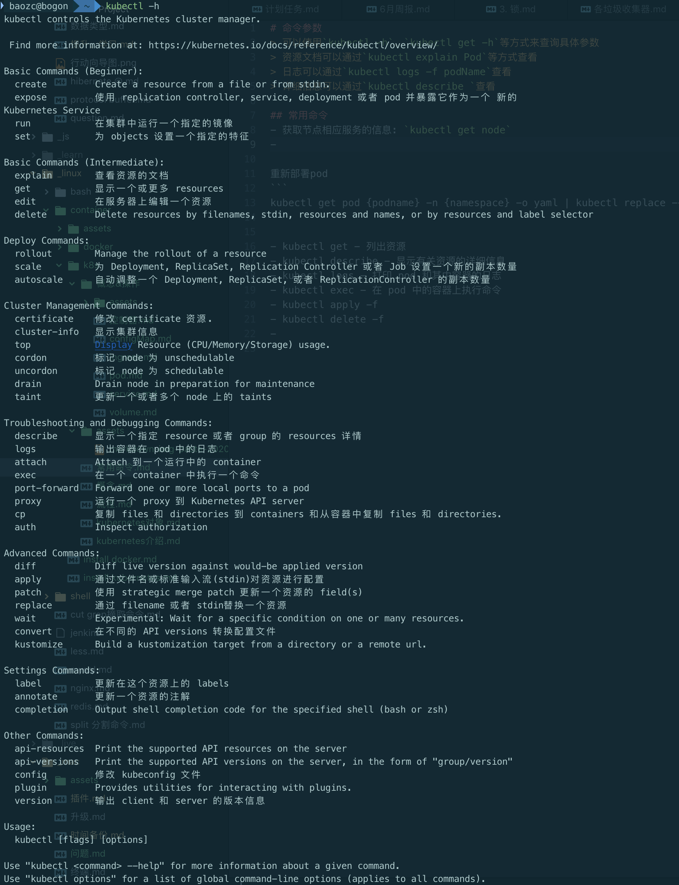

# 命令参数
> 可以使用`kubectl -h`、`kubectl get -h`等方式来查询具体参数
> 资源文档可以通过`kubectl explain Pod`等方式查看
> 日志可以通过`kubectl logs -f podName`查看
> 详细信息可以通过`kubectl describe `查看

# 常用命令
- 获取节点相应服务的信息: `kubectl get node`
- 查看K8S集群信息: `kubectl cluster-info`
- 查看pods所在的运行节点: `kubectl get pod -o wide`
- 如果需要通过某个命名空间查找节点信息， 可以通过以下命令查看：
  - `kubectl get pods -o wide -n kube-system`
    - -o wide 选项表示展示更多的Pod节点信息
    - -n <命名空间> 表示查询该命名空间下的Pod节点信息
- 如果需要查找所有命名空间下的所有Pod信息， 可以通过以下命令：`kubectl get pods --all-namespaces`
- 查看pods定义的详细信息(yaml): `kubectl get pod -o yaml`
- 查看运行的pod的环境变量: `kubectl exec podName env`
- 重新部署pod: `kubectl get pod {podname} -n {namespace} -o yaml | kubectl replace --force -f -`


- 创建资源
  - `kubectl create -f *.yaml`
  - `kubectl apply -f *.yaml`，推荐这种方式
- 重建资源
  - `kubectl replace -f *.yaml`
- 删除资源
  - 强制删除某个文件名命名节点 `kubectl delete -f <文件名>`
  - 删除某个Pod命令节点 `kubectl delete pod <pod名>`
  - 删除某个Replication Controller命名节点 `kubectl delete rc <rc名>`
  - 删除某个服务命名节点 `kubectl delete service <service名>`
  - 删除所有Pod节点 `kubectl delete pod --all`
  - 根据`yaml`文件删除资源，如果文件里有多个资源一起删除: `kubectl delete -f *.yaml`

## 动态伸缩操作
- 为Replcation Controller名称为nginx动态扩展5个服务节点: `kubectl scale rc nginx --replicas=5`
- 为redis-slave部署5 个服务节点: `kubectl scale deployment redis-slave --replicas=5`
- 为redis-slave-deployment.yaml部署脚本下的服务扩展2个节点: `kubectl scale --replicas=2 -f redis-slave-deployment.yaml`
-
## 进入Pod节点容器内进行操作
`kubectl exec -it redis-master-1033017107-q47hh /bin/bash`

## Pod节点容器标签操作
- 增加Node节点label值: `kubectl label nodes node1 zone=north`
- 增加Pod的label值 [key]=[value] : `kubectl label pod redis-master-1033017107-q47hh role=master`
- 删除Pod的label值: `kubectl label pod redis-master-1033017107-q47hh role-`
- 修改Pod的label值: `kubectl label pod redis-master-1033017107-q47hh role=backend --overwrite`


# 命令介绍
`kubernetes`通过`kube-apiserver`作为整个集群管理的入口。`Apiserver`是整个集群的主管理节点，用户通过`Apiserver`配置和组织集群，同时集群中各个节点同`etcd`存储的交互也是通过`Apiserver`进行交互。`Apiserver`实现了一套`RESTfull`的接口，用户可以直接使用`API`同`Apiserver`交互。另外官方还提供了一个客户端`kubectl`随工具集打包，用于可直接通过`kubectl`以命令行的方式同集群交互。

## help
类似于所有的命令行工具工具，kubectl也可以直接执行<kubectl>或<kubectl help> | <kubectl --help>可获得命令的帮助信息。如下图所示，kubectl使用方式为：
```
Usage：
    kubectl [flags]
    kubectl [commond]
```

另外所有的命令选项都可以通过执行 `--help`或者`-h`获得特定命令的帮助信息。


## get
`get`命令用于获取集群的一个或一些`resource`信息。

使用`--help`查看详细信息。`kubectl`的帮助信息、示例相当详细，而且简单易懂。建议大家习惯使用帮助信息。

`kubectl`可以列出集群所有`resource`的详细。`resource`包括集群节点、运行的`pod`，`ReplicationController`，`service`等。
```
Usage:
  kubectl get
[(-o|--output=)json|yaml|wide|custom-columns=...|custom-columns-file=...|go-template=...|go-template-file=...|jsonpath=...|jsonpath-file=...]
(TYPE[.VERSION][.GROUP] [NAME | -l label] | TYPE[.VERSION][.GROUP]/NAME ...) [flags] [options]
```

### 获取一些更具体的信息，可以通过使用选项“-o”
- `kubectl get po <podname> -o yaml` 以yawl格式输出pod的详细信息。
- `kubectl get po <podname> -o json` 以jison格式输出pod的详细信息。
- 另外还可以使用”`-o=custom-columns=`“定义直接获取指定内容的值。如前面使用`json`和`ymal`格式的输出中，m`etadata.labels.app`的值可以使用如下命令获取。
  - `kubectl get po rc-nginx-2-btv4j -o=custom-columns=LABELS:.metadata.labels.app`

## describe
`describe`类似于`get`，同样用于获取`resource`的相关信息。不同的是，`get`获得的是更详细的`resource`个性的详细信息，`describe`获得的是`resource`集群相关的信息。`describe`命令同`get`类似，但是`describe`不支持`-o`选项， **对于同一类型`resource`，`describe`输出的信息格式，内容域相同。**

**注：如果发现是查询某个`resource`的信息，使用`get`命令能够获取更加详尽的信息。但是如果想要查询某个`resource`的状态，如某个`pod`并不是在`running`状态，这时需要获取更详尽的状态信息时，就应该使用`describe`命令。**
```
kubectl describe pod rc-nginx-2-btv4j
```

## create
`kubectl`命令用于根据文件或输入创建集群`resource`。如果已经定义了相应`resource`的`yaml`或`json`文件，直接`kubectl create -f filename`即可创建文件内定义的`resource`。也可以直接只用子命令`[namespace/secret/configmap/serviceaccount]`等直接创建相应的`resource`。从追踪和维护的角度出发，建议使用`json`或`yaml`的方式定义资源。 
```
kubectl create -f rc-nginx.yaml
```

## replace
`replace`命令用于对已有资源进行更新、替换。如前面`create`中创建的`nginx`，当我们需要更新`resource`的一些属性的时候，如果修改副本数量，增加、修改`label`，更改`image`版本，修改端口等。都可以直接修改原`yaml`文件，然后执行`replace`命令。

**注：名字不能被更更新。另外，如果是更新`label`，原有标签的`pod`将会与更新`label`后的`rc`断开联系，有新`label`的`rc`将会创建指定副本数的新的`pod`，但是默认并不会删除原来的`pod`。所以此时如果使用`get pod`将会发现pod数翻倍，进一步check会发现原来的pod已经不会被新rc控制，此处只介绍命令不详谈此问题，好奇者可自行实验。**
```
kubectl replace -f rc-nginx.yaml
```

## patch
如果一个容器已经在运行，这时需要对一些容器属性进行修改，又不想删除容器，或不方便通过`replace`的方式进行更新。 **_`kubernetes`还提供了一种在容器运行时，直接对容器进行修改的方式，就是`patch`命令。_**

如前面创建`pod`的`label`是`app=nginx-2`，如果在运行过程中，需要把其`label`改为`app=nginx-3`，这`patch`命令如下：
```
kubectl patch pod rc-nginx-2-kpiqt -p '{"metadata":{"labels":{"app":"nginx-3"}}}'
```

## edit
`edit`提供了另一种更新`resource`源的操作，通过`edit`能够灵活的在一个`common`的`resource`基础上，发展出更过的`significant resource`。例如，使用`edit`直接更新前面创建的`pod`的命令为：
```
kubectl edit po rc-nginx-btv4j
```
上面命令的效果等效于：
```
kubectl get po rc-nginx-btv4j -o yaml >> /tmp/nginx-tmp.yaml
vim /tmp/nginx-tmp.yaml
/*do some changes here */
kubectl replace -f /tmp/nginx-tmp.yaml
```

## Delete
根据`resource`名或`label`删除`resource`。
```
kubectl delete -f rc-nginx.yaml
kubectl delete po rc-nginx-btv4j
kubectl delete po -lapp=nginx-2
```

## apply
`apply`命令提供了比`patch`，`edit`等更严格的更新`resource`的方式。通过`apply`，用户可以将`resource`的`configuration`使用`source control`的方式维护在版本库中。每次有更新时，将配置文件`push`到`server`，然后使用`kubectl apply`将更新应用到`resource`。**_`kubernetes`会在引用更新前将当前配置文件中的配置同已经应用的配置做比较，并只更新更改的部分，而不会主动更改任何用户未指定的部分。_** 

**_`apply`命令的使用方式同`replace`相同，不同的是，`apply`不会删除原有`resource`，然后创建新的。`apply`直接在原有`resource`的基础上进行更新。同时`kubectl apply`还会在`resource`中添加一条注释，标记当前的`apply`。类似于`git`操作。_**

## logs
`logs`命令用于显示`pod`运行中，容器内程序输出到标准输出的内容。跟`docker`的`logs`命令类似。如果要获得`tail -f `的方式，也可以使用`-f`选项。
```
kubectl logs rc-nginx-2-kpiqt
```

## rolling-update
`rolling-update`是一个非常重要的命令，对于已经部署并且正在运行的业务，`rolling-update`提供了不中断业务的更新方式。`rolling-update`每次起一个新的`pod`，等新`pod`完全起来后删除一个旧的`pod`，然后再起一个新的`pod`替换旧的`pod`，直到替换掉所有的`pod`。 

`rolling-update`需要确保新的版本有不同的`name`，`Version`和`label`，否则会报错
```
kubectl rolling-update rc-nginx-2 -f rc-nginx.yaml
```
如果在升级过程中，发现有问题还可以中途停止update，并回滚到前面版本
```
kubectl rolling-update rc-nginx-2 —rollback
```
例：
- 配置文件滚动升级: `kubectl rolling-update redis-master -f redis-master-controller-v2.yaml`
- 命令升级: `kubectl rolling-update redis-master --image=redis-master:2.0`
- Pod版本回滚: `kubectl rolling-update redis-master --image=redis-master:1.0 --rollback`

## scale
**`scale`用于程序在负载加重或缩小时副本进行扩容或缩小**，如前面创建的`nginx`有两个副本，可以轻松的使用`scale`命令对副本数进行扩展或缩小。
扩展副本数到4：
```
kubectl scale rc rc-nginx-3 —replicas=4
```
重新缩减副本数到2：
```
kubectl scale rc rc-nginx-3 —replicas=2
```

## autoscale
`scale`虽然能够很方便的对副本数进行扩展或缩小，但是仍然需要人工介入，不能实时自动的根据系统负载对副本数进行扩、缩。**`autoscale`命令提供了自动根据pod负载对其副本进行扩缩的功能。** 

`autoscale`命令会给一个`rc`指定一个副本数的范围，在实际运行中根据`pod`中运行的程序的负载自动在指定的范围内对`pod`进行扩容或缩容。如前面创建的`nginx`，可以用如下命令指定副本范围在1~4 
```
kubectl autoscale rc rc-nginx-3 —min=1 —max=4
```

## cordon, drain, uncordon
这三个命令是正式release的1.2新加入的命令，三个命令一起介绍，是因为三个命令配合使用可以实现节点的维护。在1.2之前，因为没有相应的命令支持，如果要维护一个节点，只能stop该节点上的kubelet将该节点退出集群，是集群不在将新的pod调度到该节点上。如果该节点上本生就没有pod在运行，则不会对业务有任何影响。如果该节点上有pod正在运行，kubelet停止后，master会发现该节点不可达，而将该节点标记为notReady状态，不会将新的节点调度到该节点上。同时，会在其他节点上创建新的pod替换该节点上的pod。这种方式虽然能够保证集群的健壮性，但是任然有些暴力，如果业务只有一个副本，而且该副本正好运行在被维护节点上的话，可能仍然会造成业务的短暂中断。 

1.2中新加入的这3个命令可以保证维护节点时，平滑的将被维护节点上的业务迁移到其他节点上，保证业务不受影响。如下图所示是一个整个的节点维护的流程（为了方便demo增加了一些查看节点信息的操作）：1）首先查看当前集群所有节点状态，可以看到共四个节点都处于ready状态；2）查看当前nginx两个副本分别运行在d-node1和k-node2两个节点上；3）使用cordon命令将d-node1标记为不可调度；4）再使用kubectl get nodes查看节点状态，发现d-node1虽然还处于Ready状态，但是同时还被禁能了调度，这意味着新的pod将不会被调度到d-node1上。4）再查看nginx状态，没有任何变化，两个副本仍运行在d-node1和k-node2上；5）执行drain命令，将运行在d-node1上运行的pod平滑的赶到其他节点上；6）再查看nginx的状态发现，d-node1上的副本已经被迁移到k-node1上；这时候就可以对d-node1进行一些节点维护的操作，如升级内核，升级Docker等；7）节点维护完后，使用uncordon命令解锁d-node1，使其重新变得可调度；8）检查节点状态，发现d-node1重新变回Ready状态。 

## attach
`attach`命令类似于`docker`的`attach`命令，可以直接查看容器中以`daemon`形式运行的进程的输出，效果类似于`logs -f`，退出查看使用`ctrl-c`。 **如果一个`pod`中有多个容器，要查看具体的某个容器的的输出，需要在`pod`名后使用`-c containers name`指定运行的容器。**如下示例的命令为查看`kube-system namespace`中的`kube-dns-v9-rcfuk` `pod`中的`skydns`容器的输出。 
```
kubectl attach kube-dns-v9-rcfuk -c skydns —namespace=kube-system
```

## exec
`exec`命令同样类似于`docker`的`exe`c命令，为在一个已经运行的容器中执行一条`shell`命令，如果一个`pod`容器中，有多个容器，需要使用`-c`选项指定容器。

## port-forward

## proxy

## run
类似于`docker`的`run`命令，直接运行一个`image`。

## label
为`kubernetes`集群的`resource`打标签，如前面实例中提到的为`rc`打标签对`rc`分组。还可以对`nodes`打标签，这样在编排容器时，可以为容器指定`nodeSelector`将容器调度到指定`lable`的机器上，如如果集群中有IO密集型，计算密集型的机器分组，可以将不同的机器打上不同标签，然后将不同特征的容器调度到不同分组上。

---
> 参考文章：
> - [Kubernetes之kubectl常用命令][d83f855f]
> - [Kubernetes常用命令][fe12cf4a]

  [d83f855f]: https://blog.csdn.net/xingwangc2014/article/details/51204224 "Kubernetes之kubectl常用命令"
  [fe12cf4a]: https://www.jianshu.com/p/2ded3a8cc788 "Kubernetes常用命令"
