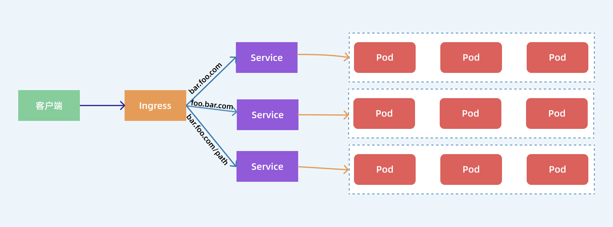

# ingress按照下属方式，无法访问

- 官网MacOS安装igress，也不成功，https://kubernetes.github.io/ingress-nginx/deploy/


# 对外暴露集群服务 `ingress`
前面我们学习了在 `Kubernetes` 集群内部使用 `kube-dns` 实现服务发现的功能，那么我们部署在 `Kubernetes` 集群中的应用如何暴露给外部的用户使用呢？**_我们知道可以使用 `NodePort` 和 `LoadBlancer` 类型的 `Service` 可以把应用暴露给外部用户使用_**，除此之外，`Kubernetes` 还为我们提供了一个非常重要的资源对象可以用来暴露服务给外部用户，那就是 `Ingress`。对于小规模的应用我们使用 `NodePort` 或许能够满足我们的需求，但是当你的应用越来越多的时候，你就会发现对于 `NodePort` 的管理就非常麻烦了，这个时候使用 `Ingress` 就非常方便了，可以避免管理大量的端口。

**_`Ingress` 其实就是从 `Kuberenets` 集群外部访问集群的一个入口，将外部的请求转发到集群内不同的 `Service` 上，其实就相当于 `nginx`、`haproxy` 等负载均衡代理服务器_**，可能你会觉得我们直接使用 `nginx` 就实现了，但是只使用 `nginx` 这种方式有很大缺陷，每次有新服务加入的时候怎么改 `Nginx` 配置？不可能让我们去手动更改或者滚动更新前端的 `Nginx Pod` 吧？那我们再加上一个服务发现的工具比如 `consul` 如何？貌似是可以，对吧？**_`Ingress` 实际上就是这样实现的，只是服务发现的功能自己实现了，不需要使用第三方的服务了，然后再加上一个域名规则定义，路由信息的刷新依靠 `Ingress Controller` 来提供。_**

**_`Ingress Controller` 可以理解为一个监听器，通过不断地监听 `kube-apiserver`，实时的感知后端 `Service`、`Pod` 的变化，当得到这些信息变化后，`Ingress Controller` 再结合 `Ingress` 的配置，更新反向代理负载均衡器，达到服务发现的作用。_** 其实这点和服务发现工具 `consul`、 `consul-template` 非常类似。



现在可以供大家使用的 `Ingress Controller` 有很多，比如 `traefik`、`nginx-controller`、`Kubernetes Ingress Controller for Kong`、`HAProxy Ingress controller`，当然你也可以自己实现一个 `Ingress Controller`，**_现在普遍用得较多的是 `traefik` 和 `nginx-controller`，`traefik` 的性能较 `nginx-controller` 差，但是配置使用要简单许多，我们这里会重点给大家介绍 `nginx-controller` 以及 `traefik` 的使用。_**

# NGINX Ingress Controller
`NGINX Ingress Controller` 是使用 `Kubernetes Ingress` 资源对象构建的，用 `ConfigMap` 来存储 `Nginx` 配置的一种 `Ingress Controller` 实现。

**要使用 `Ingress` 对外暴露服务，就需要提前安装一个 `Ingress Controller`，我们这里就先来安装 `NGINX Ingress Controller`，由于 `nginx-ingress` 所在的节点需要能够访问外网，这样域名可以解析到这些节点上直接使用，所以需要让 `nginx-ingress` 绑定节点的 `80` 和 `443` 端口，所以可以使用 `hostPort` 来进行访问，当然对于线上环境来说为了保证高可用，一般是需要运行多个 `nginx-ingress` 实例的，然后可以用一个 `nginx/haproxy` 作为入口，通过 `keepalived` 来访问边缘节点的 `vip` 地址。**

> - **_边缘节点_**
>
> 所谓的边缘节点即集群内部用来向集群外暴露服务能力的节点，集群外部的服务通过该节点来调用集群内部的服务，边缘节点是集群内外交流的一个`Endpoint`。
>
> 边缘节点就是最外部的节点 所有访问通过边缘节点作为访问入口。
>
> ingress-controller就是个边缘节点
>
> k8s训练营上修改`mandatory.yaml`，是为了把`ingress-controller`跑到固定得节点node上

下载`ingress controller`资源清单
```bash
wget --no-check-certificate https://raw.githubusercontent.com/kubernetes/ingress-nginx/nginx-0.26.1/deploy/static/mandatory.yaml
```
这个资源清单里包含了`ingress`相关的配置：`configmap`、`namespace`、`deployment`等

安装后会将 NGINX Ingress Controller 安装在一个统一的 ingress-nginx 的 namespace 下面：
```
```

## Ingress
安装成功后，现在我们来为一个 nginx 应用创建一个 Ingress 资源，如下所示：
```yaml
apiVersion: apps/v1
kind: Deployment
metadata:
  name: my-nginx
spec:
  selector:
    matchLabels:
      app: my-nginx
  template:
    metadata:
      labels:
        app: my-nginx
    spec:
      containers:
      - name: my-nginx
        image: nginx
        ports:
        - containerPort: 80
---
apiVersion: v1
kind: Service
metadata:
  name: my-nginx
  labels:
    app: my-nginx
spec:
  ports:
  - port: 80
    protocol: TCP
    name: http
  selector:
    app: my-nginx
---
apiVersion: extensions/v1beta1
kind: Ingress
metadata:
  name: my-nginx
  annotations:
    kubernetes.io/ingress.class: "nginx"
spec:
  rules:
  - host: ngdemo.qikqiak.com  # 将域名映射到 my-nginx 服务
    http:
      paths:
      - path: /
        backend:
          serviceName: my-nginx  # 将所有请求发送到 my-nginx 服务的 80 端口
          servicePort: 80     # 不过需要注意大部分Ingress controller都不是直接转发到Service
                            # 而是只是通过Service来获取后端的Endpoints列表，直接转发到Pod，这样可以减少网络跳转，提高性能
```
