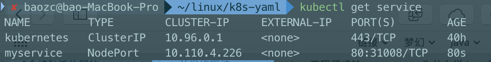
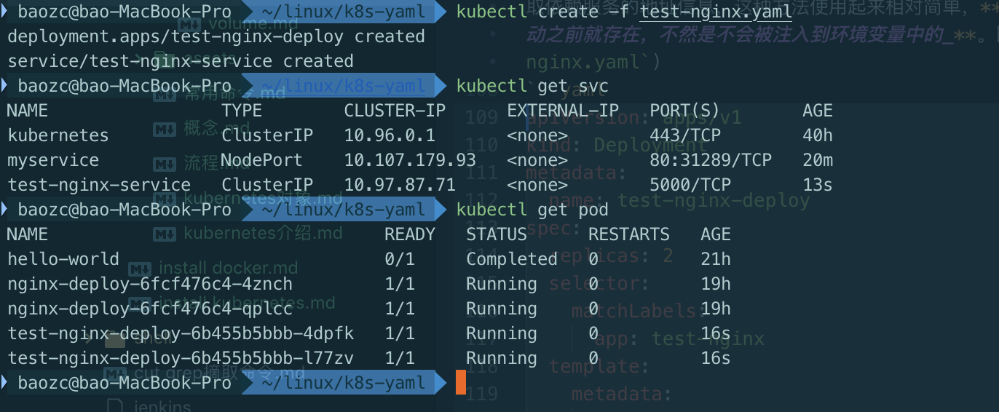
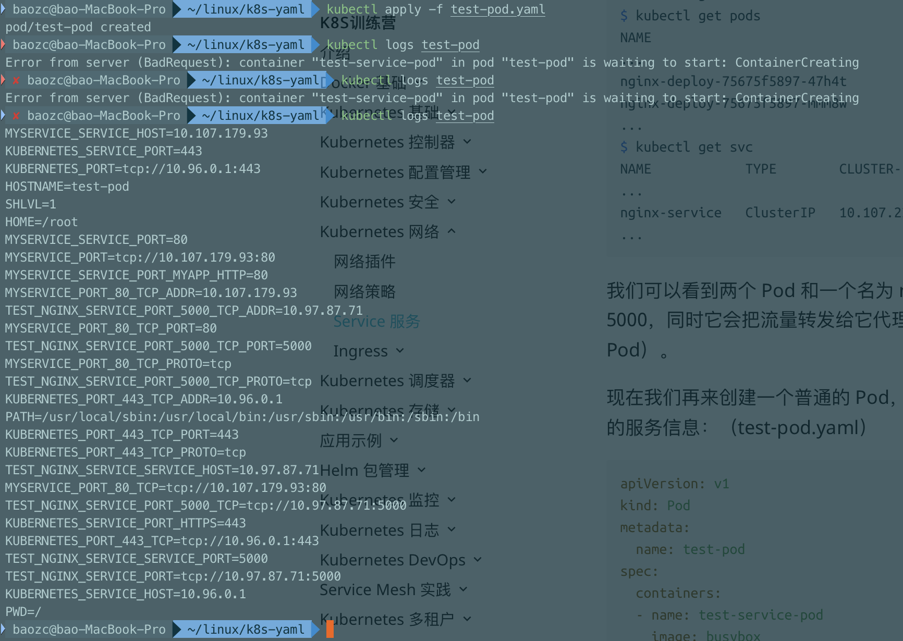

# 命令
`kubectl get svc`，`svc`是`service`的缩写，两个都可以使用

# 定义
`Service` 是一种抽象的对象，它定义了一组 `Pod` 的逻辑集合和一个用于访问它们的策略，其实这个概念和微服务非常类似。**_一个 `Serivce` 下面包含的 `Pod` 集合是由 `Label Selector` 来决定的。_**

# 三种IP
在继续往下学习 Service 之前，我们需要先弄明白 Kubernetes 系统中的三种IP，因为经常有同学混乱。
- `Node IP`：Node 节点的 IP 地址
- `Pod IP`: Pod 的 IP 地址
- `Cluster IP`: Service 的 IP 地址

首先，`Node IP` 是 `Kubernetes` 集群中节点的物理网卡 `IP` 地址(**一般为内网**)，所有属于这个网络的服务器之间都可以直接通信，所以 `Kubernetes` 集群外要想访问 `Kubernetes` 集群内部的某个节点或者服务，肯定得通过 `Node IP` 进行通信（**这个时候一般是通过外网 IP 了**）

然后 `Pod IP` 是每个 `Pod` 的 `IP` 地址，它是网络插件进行分配的，前面我们已经讲解过

最后 `Cluster IP` 是一个虚拟的 `IP`，仅仅作用于 `Kubernetes Service` 这个对象，由 `Kubernetes` 自己来进行管理和分配地址。

# 定义 Service
定义 `Service` 的方式和我们前面定义的各种资源对象的方式类似，例如，假定我们有一组 `Pod` 服务，它们对外暴露了 `80` 端口，同时都被打上了 `app=nginx` 这样的标签，那么我们就可以像下面这样来定义一个 `Service` 对象：
```yaml
apiVersion: v1
kind: Service
metadata:
  name: myservice
spec:
  selector:
    app: nginx
  ports:
  - protocol: TCP
    port: 80
    targetPort: 80
    name: myapp-http
```

然后通过的使用`kubectl create -f nginx-service.yaml`就可以创建一个名为 `myservice` 的 `Service` 对象，它会将请求代理到使用 `TCP` 端口为 `80`，具有标签 `app=myapp` 的 `Pod` 上，这个 `Service` 会被系统分配一个我们上面说的 `Cluster IP`，该 `Service` 还会持续的监听 `selector` 下面的 `Pod`，会把这些 `Pod` 信息更新到一个名为 `myservice` 的`Endpoints` 对象上去，这个对象就类似于我们上面说的 `Pod` 集合了。

> 需要注意的是，Service 能够将一个接收端口映射到任意的 targetPort。默认情况下，targetPort 将被设置为与 port 字段相同的值。可能更有趣的是，targetPort 可以是一个字符串，引用了 backend Pod 的一个端口的名称。因实际指派给该端口名称的端口号，在每个 backend Pod 中可能并不相同，所以对于部署和设计 Service，这种方式会提供更大的灵活性。
>
> 另外 Service 能够支持 TCP 和 UDP 协议，默认是 TCP 协议。

## kube-proxy
前面我们讲到过，在 `Kubernetes` 集群中，每个 `Node` 会运行一个 `kube-proxy` 进程, 负责为 `Service` 实现一种 `VIP`（**虚拟 IP，就是我们上面说的 clusterIP**）的代理形式，现在的 `Kubernetes` 中默认是使用的 `iptables` 这种模式来代理。

- iptables
- ipvs

# Service
我们在定义 `Service` 的时候可以指定一个自己需要的类型的 `Service`，如果不指定的话默认是 `ClusterIP`类型。

我们可以使用的服务类型如下：
- **`ClusterIP`：** 通过集群的内部 `IP` 暴露服务，选择该值，**_服务只能够在集群内部可以访问_**，这也是默认的服务类型。
- **`NodePort`：** 通过每个 `Node` 节点上的 `IP` 和静态端口（`NodePort`）暴露服务。`NodePort` 服务会路由到 `ClusterIP` 服务，这个 `ClusterIP` 服务会自动创建。通过请求 `NodeIp:NodePort`，**_可以从集群的外部访问一个 `NodePort` 服务_**。
- **`LoadBalancer`：** 使用云提供商的负载局衡器，可以向外部暴露服务。外部的负载均衡器可以路由到 `NodePort` 服务和 `ClusterIP` 服务，**_这个需要结合具体的云厂商进行操作_**。
- **`ExternalName`：** 通过返回 `CNAME` 和它的值，可以将服务映射到 `externalName` 字段的内容（**_例如， foo.bar.example.com_**）。

## NodePort 类型
如果设置 `type` 的值为 "`NodePort`"，`Kubernetes master` 将从给定的配置范围内（**默认：30000-32767**）分配端口，每个 `Node` 将从该端口（每个 `Node` 上的同一端口）代理到 `Service`。该端口将通过 `Service` 的 `spec.ports[*].nodePort` 字段被指定，如果不指定的话会自动生成一个端口。

需要注意的是，`Service` 将能够通过 `spec.ports[].nodePort` 和 `spec.clusterIp:spec.ports[].port` 而对外可见。

接下来我们来给大家创建一个 `NodePort` 的服务来访问我们前面的 `Nginx` 服务：(**service-nodeport-demo.yaml**)
```yaml
apiVersion: v1
kind: Service
metadata:
  name: myservice
spec:
  selector:
    app: nginx
  type: NodePort
  ports:
  - protocol: TCP
    port: 80
    targetPort: 80
    name: myapp-http
```
创建该`service`
```bash
kubectl create -f nginx-service.yaml
```

我们可以看到 `myservice` 的 `TYPE` 类型已经变成了 `NodePort`，后面的 `PORT(S)` 部分也多了一个 `31008` 的映射端口。


## ExternalName
ExternalName 是 Service 的特例，它没有 selector，也没有定义任何的端口和 Endpoint。对于运行在集群外部的服务，它通过返回该外部服务的别名这种方式来提供服务。
```yaml
kind: Service
apiVersion: v1
metadata:
  name: my-service
  namespace: prod
spec:
  type: ExternalName
  externalName: my.database.example.com
```

**[详细信息][ecf4abda]**

  [ecf4abda]: https://www.qikqiak.com/k8strain/network/service/ "service"

# 服务发现
上面我们讲解了 `Service` 的用法，我们可以通过 `Service` 生成的 `ClusterIP`(VIP) 来访问 `Pod` 提供的服务，但是在使用的时候还有一个问题：我们怎么知道某个应用的 `VIP` 呢？比如我们有两个应用，一个是 `api` 应用，一个是 `db` 应用，两个应用都是通过 `Deployment` 进行管理的，并且都通过 `Service` 暴露出了端口提供服务。`api` 需要连接到 `db` 这个应用，我们只知道 `db` 应用的名称和 `db` 对应的 `Service` 的名称，但是并不知道它的 `VIP` 地址，我们前面的 `Service` 课程中是不是学习到我们通过 `ClusterIP` 就可以访问到后面的 `Pod` 服务，如果我们知道了 `VIP` 的地址是不是就行了？

## 环境变量
为了解决上面的问题，在之前的版本中，**_`Kubernetes` 采用了环境变量的方法_**，每个 `Pod` 启动的时候，会通过环境变量设置所有服务的 `IP` 和 `port` 信息，这样 `Pod` 中的应用可以通过读取环境变量来获取依赖服务的地址信息，这种方法使用起来相对简单，**_但是有一个很大的问题就是依赖的服务必须在 `Pod` 启动之前就存在，不然是不会被注入到环境变量中的_**。比如我们首先创建一个 `Nginx` 服务：(`test-nginx.yaml`)
```yaml
apiVersion: apps/v1
kind: Deployment
metadata:
  name: test-nginx-deploy
spec:
  replicas: 2
  selector:
    matchLabels:
      app: test-nginx
  template:
    metadata:
      labels:
        app: test-nginx
    spec:
      containers:
      - name: nginx
        image: nginx:1.7.9
        ports:
        - containerPort: 80
---
apiVersion: v1
kind: Service
metadata:
  name: test-nginx-service
  labels:
    name: nginx-service
spec:
  ports:
  - port: 5000
    targetPort: 80
  selector:
    app: test-nginx
```
创建上面的服务：


我们可以看到两个 `Pod` 和一个名为 `test-nginx-service` 的服务创建成功了，该 `Service` 监听的端口是 `5000`，同时它会把流量转发给它代理的所有 `Pod`（**_我们这里就是拥有 `app: test-nginx` 标签的两个 `Pod`_**）。

现在我们再来创建一个普通的 `Pod`，观察下该 `Pod` 中的环境变量是否包含上面的 `test-nginx-service` 的服务信息：（`test-pod.yaml`）
```yaml
apiVersion: v1
kind: Pod
metadata:
  name: test-pod
spec:
  containers:
  - name: test-service-pod
    image: busybox
    command: ["/bin/sh", "-c", "env"]
```
然后创建该测试的 `Pod`，并查看日志：


我们可以看到打印了很多环境变量信息，其中就包括我们刚刚创建的 `test-nginx-service` 这个服务，有 `HOST`、`PORT`、`PROTO`、`ADDR` 等，也包括其他已经存在的 `Service` 的环境变量，现在如果我们需要在这个 `Pod` 里面访问 `test-nginx-service` 的服务，我们是不是可以直接通过 `TEST_NGINX_SERVICE_SERVICE_HOST` 和 `TEST_NGINX_SERVICE_SERVICE_PORT` 就可以了，但是如果这个 `Pod` 启动起来的时候 `nginx-service` 服务还没启动起来，在环境变量中我们是无法获取到这些信息的，当然我们可以通过 `initContainer` 之类的方法来确保 `test-nginx-service` 启动后再启动 `Pod`，但是这种方法毕竟增加了 `Pod` 启动的复杂性，所以这不是最优的方法，局限性太多了。

## DNS
由于上面环境变量这种方式的局限性，我们需要一种更加智能的方案，其实我们可以自己思考一种比较理想的方案：那就是 **_可以直接使用 `Service` 的名称，因为 `Service` 的名称不会变化，我们不需要去关心分配的 `ClusterIP` 的地址，因为这个地址并不是固定不变的，所以如果我们直接使用 `Service` 的名字，然后对应的 `ClusterIP` 地址的转换能够自动完成就很好了_**。我们知道名字和 `IP` 直接的转换是不是和我们平时访问的网站非常类似啊？他们之间的转换功能通过 `DNS` 就可以解决了，同样的，**_`Kubernetes` 也提供了 `DNS` 的方案来解决上面的服务发现的问题。_**

`DNS` 服务不是一个独立的系统服务，而是作为一种 `addon` 插件而存在，现在比较推荐的两个插件：`kube-dns` 和 `CoreDNS`，实际上在比较新点的版本中已经默认是 `CoreDNS` 了，因为 `kube-dns` 默认一个 `Pod` 中需要3个容器配合使用，`CoreDN`S 只需要一个容器即可，我们在前面使用 `kubeadm` 搭建集群的时候直接安装的就是 `CoreDNS` 插件：
```bash
$ kubectl get pods -n kube-system -l k8s-app=kube-dns
NAME                       READY   STATUS    RESTARTS   AGE
coredns-667f964f9b-sthqq   1/1     Running   0          32m
coredns-667f964f9b-zj4r4   1/1     Running   0          33m
```

`CoreDns` 是用 `GO` 写的高性能，高扩展性的 `DNS` 服务，基于 `HTTP/2 Web` 服务 `Caddy` 进行编写的。`CoreDns` 内部采用插件机制，所有功能都是插件形式编写，用户也可以扩展自己的插件，以下是 `Kubernetes` 部署 `CoreDns` 时的默认配置：
```bash
$ kubectl get cm coredns -n kube-system -o yaml
```
```yaml
apiVersion: v1
data:
  Corefile: |
    .:53 {
        errors  # 启用错误记录
        health  # 启用检查检查端点，8080:health
        ready
        kubernetes cluster.local in-addr.arpa ip6.arpa {  # 处理 k8s 域名解析
           pods insecure
           fallthrough in-addr.arpa ip6.arpa
           ttl 30
        }
        prometheus :9153  # 启用 prometheus metrics 指标，9153:metrics
        forward . /etc/resolv.conf  # 通过 resolv.conf 内的 nameservers 解析
        cache 30  # 启用缓存，所有内容限制为 30s 的TTL
        loop  # 检查简单的转发循环并停止服务
        reload  # 运行自动重新加载 corefile，热更新
        loadbalance  # 负载均衡，默认 round_robin
    }
kind: ConfigMap
metadata:
  creationTimestamp: "2019-11-08T11:59:49Z"
  name: coredns
  namespace: kube-system
  resourceVersion: "188"
  selfLink: /api/v1/namespaces/kube-system/configmaps/coredns
  uid: 21966186-c2d9-467a-b87f-d061c5c9e4d7
```
- 每个 {} 代表一个 zone,格式是 “Zone:port{}”, 其中"."代表默认zone
- {} 内的每个名称代表插件的名称，只有配置的插件才会启用，当解析域名时，会先匹配 zone（都未匹配会执行默认 zone），然后 zone 内的插件从上到下依次执行(这个顺序并不是配置文件内谁在前面的顺序，而是core/dnsserver/zdirectives.go内的顺序)，匹配后返回处理（执行过的插件从下到上依次处理返回逻辑），不再执行下一个插件

---

**我们前面说了如果我们建立的 `Service` 如果支持域名形式进行解析，就可以解决我们的服务发现的功能，那么利用 `kubedns` 可以将 `Service` 生成怎样的 `DNS` 记录呢？**

- **_普通的 `Service`：_** 会生成 `servicename.namespace.svc.cluster.local` 的域名，会解析到 `Service` 对应的 `ClusterIP` 上，**_在 `Pod` 之间的调用可以简写成 `servicename.namespace`，如果处于同一个命名空间下面，甚至可以只写成 `servicename` 即可访问_**
- **_`Headless Service`：_** 无头服务，就是把 `clusterIP` 设置为 `None` 的，会被解析为指定 `Pod` 的 `IP` 列表，同样还可以通过 `podname.servicename.namespace.svc.cluster.local` 访问到具体的某一个 `Pod`。
