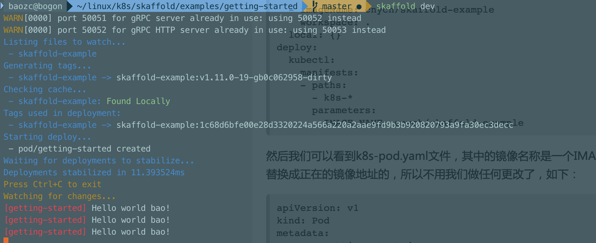

# 开发
我们可以在本地开发一个非常简单的应用程序，然后通过`Skaffold`来进行迭代开发，这里我们直接使用`Skaffold`的官方示例，首先`clone`代码：
```
git clone https://github.com/GoogleCloudPlatform/skaffold
```
然后我们定位到`examples/getting-started`目录下去：
```
$ cd examples/getting-started
$ tree .
.
├── Dockerfile
├── k8s-pod.yaml
├── main.go
└── skaffold.yaml

0 directories, 5 files
```
该目录下面有一个非常简单的`golang`程序:（`main.go`）
```go
package main
import (
    "fmt"
    "time"
)

func main() {
    for {
        fmt.Println("Hello Skaffold!")
        time.Sleep(time.Second * 2)
    }
}
```
执行`skaffold`


可以看到Skaffold已经帮我们做了很多事情了：

- 用本地源代码构建 Docker 镜像
- 用它的sha256值作为镜像的标签
- 设置skaffold.yaml文件中定义的 kubernetes manifests 的镜像地址
- 用kubectl apply -f命令来部署 kubernetes 应用

修改`main.go`，`skaffold`会实时更新
