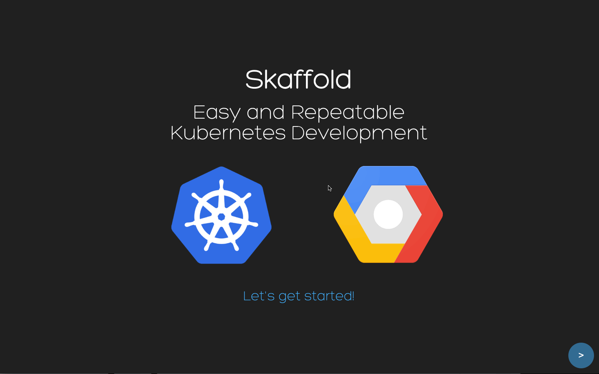

# 介绍
[`Skaffold`][427e78f0]是一款命令行工具，旨在促进`Kubernetes`应用的持续开发。你可以在本地迭代应用源码，然后将其部署到本地或者远程`Kubernetes`集群中。[`Skaffold`][427e78f0]会处理构建、上传和应用部署方面的工作流。它通用可以在自动化环境中使用，例如`CI/CD`流水线，以实施同样的工作流，并作为将应用迁移到生产环境时的工具 —— [`Skaffold`][427e78f0] [官方文档][eb5fc881]。

`Skaffold`的特点：
- 没有服务器端组件，所以不会增加你的集群开销
- 自动检测源代码中的更改并自动构建/推送/部署
- 自动更新镜像`TAG`，不要担心手动去更改`kubernetes`的 `manifest` 文件
- 一次性构建/部署/上传不同的应用，因此它对于微服务同样完美适配
- 支持开发环境和生产环境，通过仅一次运行`manifest`，或者持续观察变更

另外`Skaffold`是一个可插拔的架构，允许开发人员选择自己最合适的工作流工具

我们可以通过下面的 `gif` 图片来了解`Skaffold`的使用

## 流程介绍
- build
- push
- deploy

_`skaffold`用于开发人员快速部署程序到`Kubernetes`中；**`skaffold`提供了`dev`、`run`两种模式；** 使用`skaffold`需先编写`skaffold`配置文件，该文件为定义`skaffold`的工作流；_

在构建阶段中，它可以与`Dockerfiles`、`Kaniko`、`Google Cloud Build`、`Bazel`、`maven`和`gradle`协作。它支持通过c`ontainer-structure-test`校验构建而成的镜像。`Container-structure-test`提供了一个`YAML`配置驱动的方式来运行各种测试。

对于部署阶段，它可以与`kubectl`、`Helm`和`kustomize`协作。

### workflow
**Skaffold工作流定义了三个主要阶段：`Build`、`Push`、`Deploy`**

#### Build
在构建阶段，`Skaffold`通过`Dockerfile`使用源码生成`Artifacts`

#### Push
在推送阶段，`Skaffold`将把构建阶段生成的`Docker`镜像推送到`Docker`镜像仓库中，并使用所配置的镜像名称；在运行`Skaffold`时需确保镜像能够推送到镜像仓库中；

**_但如果使用的是`Minikube`或 `Docker for Desktop`本地`Kubernetes`集群时默认是不推送到镜像仓库的，跳过推送阶段，因为本地已经存在了该镜像所以是可以正常运行的；_**

**暂没有找到本地有环境时，怎么推送到远程仓库的解决方案**

#### Deploy
部署阶段，将最新的`Docker`镜像部署到`k8s`中，该阶段可以使用不同的部署工具如`kubectl`或`helm`，每个工具都有不一样的参数用于定义如何安装与更新应用程序；

## 概念介绍
### Artifacts
在`Build`阶段通过运行一系列步骤来创建`Artifacts`，在`Skaffold`中`Artifacts`分为`bazel`与`Docker`镜像，可以定义`Skaffold`生成多个`Docker`镜像，`Skaffold`在开发模式运行时，`Skaffold`只会重新生成源码已经更改的`Docker`镜像，通过在`Skaffold`配置中指定`Dockerfile`来生成`Docker`镜像，并指定其名称；

### 标签策略
标签策略在`Build`阶段进行配置，用于配置`Skaffold`在推送`Docker`镜像时如果对镜像进行打标签，目前`Skaffold`支持三种标签策略：
- `sha256`标签生成器
- `git`标签生成器
- `自定义`标签生成器策略；

在开发过程中，推荐使用基于内容的标签策略`sha256`，方便在源代码变更时`Skaffold`会使`Kubernetes`重新部署新`Docker`镜像；

- **`dev`模式** 默认使用sha256标签生成器
- **`run`模式** 默认使用git标签生成器

**_所以注意如果使用`run`模式又没配置`git`则`Skaffold`是无法跑下去的，需配置标签策略（`TagPolicy`），或配置`git`即可；_**

## start mode
### dev mode
开发模式可以通过`skaffold dev`启用，它会监视本地源码的变化，当探测到变化时，它会进行构建和部署。

**可以使用`skaffold dev -vdebug`来查看更多详细信息。**

在开发模式下，`Skaffold`会管道化运行中容器的日志输出并管理已部署应用到本地机器的端口转发。当文件发生变化的时候，它能够直接将文件同步到运行中的容器中，并且能够在镜像重新构建的时候，将`Kubernetes manifests`更新为新的镜像标签。

## run mode
部署模式可以通过`skaffold run`启用，它会构建一次、部署并退出，这一点使其非常适合`CI/CD`管道。

---
> 参考文章：
> - [Skaffold-简化本地开发kubernetes应用的神器](https://tsov.net/home/view/3247/)
> - [谷歌发布Skaffold的正式版本，用来简化Kubernetes的开发](https://cloud.tencent.com/developer/news/494140)
> - [使用Skaffold一键将项目发布到Kubernetes](https://cloud.tencent.com/developer/news/181181)

[427e78f0]: https://github.com/GoogleContainerTools/skaffold "Skaffold"
[eb5fc881]: https://skaffold.dev/docs/ "Skaffold Docs"
