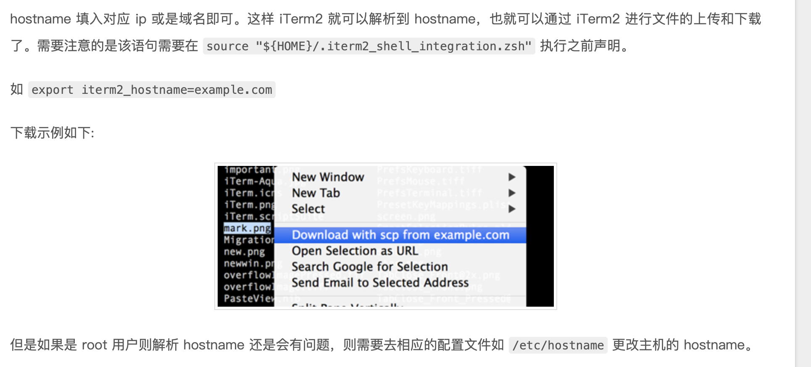

### 常用快捷键
- `cmd+shift+e` 显示每行命令的执行时间，view - Show Timestamps
- `cmd+option+;` 高亮显示光标所在行，view - Show cursor guide
- `cmd+option+f` 显示密码管理器，Window > Password Manager
- `cmd+option+e` 在一个显示屏中，显示所有iterm窗口， window - expose all tab
- `cmd+z` 撤销关闭tab，5秒内
- `cmd+shift+o` 快速切换到指定tab
- `cmd+shift+m` 标记当前行，edit > marks and annotations
- 下载iterm2脚本，iterm2 >  install "Shell Integration"

服务器配置
若服务器的hostname不是所连接的IP地址的话，或者服务器的ssh服务端口号不为默认的22，需要在用户的环境变量配置文件（文件名为.profile，没有可以新建）中增加相关环境变量:
export iterm2_hostname=183.166.333.91:222
操作方法
从远程服务器下载文件时，只需选择该文件，右键菜单中有下载选项。
上传文件时，只需在拖拽文件的同时，需按住“Option”键。

