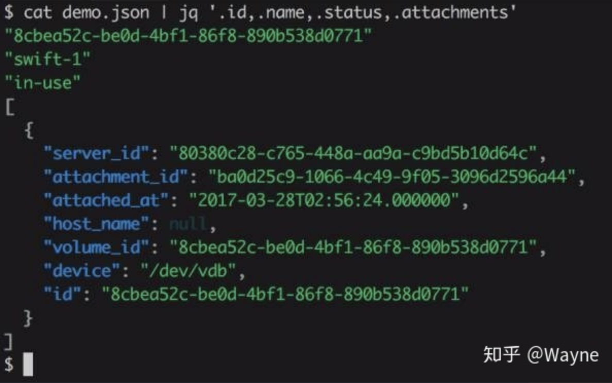

### thefuck

用途是每次命令行打错了以后，打一句fuck就会自动更正命令。比如apt-get打成了aptget。fuck以后自动变成apt-get。但还是没加sudo。再fuck，成功！


### jq
json文件处理以及格式化显示，支持高亮，可以替换python -m json.tool。



### mycli
mysql客户端，支持语法高亮和命令补全，效果类似ipython，可以替代mysql命令。


### [http][2fcb867a] [中文说明文档][76d6883d]
curl 的升级美化版,高亮效果和返回结果格式化效果
```
http [flags] [METHOD] URL [ITEM [ITEM]]
```
- 带参数时，默认是application/json post格式
- 当METHOD命令中省略参数时，HTTPie默认为GET（无请求数据）或POST（有请求数据）。
- 默认方案是http://并且可以从参数中省略：
- http -v ....，v

  [76d6883d]: https://keelii.com/2018/09/03/HTTPie/ "中文说明文档"

默认情况下，HTTPie仅输出最终响应，并打印整个响应消息（标头和正文）。您可以通过几个选项控制应打印的内容：
| `--headers, -h` | 仅打印响应标题。                                                  |
| --------------- | ----------------------------------------------------------------- |
| `--body, -b`    | 仅打印响应正文。                                                  |
| `--verbose, -v` | 打印整个HTTP交换（请求和响应）。此选项也启用--all（请参阅下文）。 |
| `--print, -p`   | 选择HTTP交换的部分。                                              |


### [icdiff][dd3bb1a2]
diff 的 升级美化版, 高亮文件差异对比工具

  [2fcb867a]: https://github.com/jakubroztocil/httpie/ "httpie"
  [dd3bb1a2]: https://github.com/jeffkaufman/icdiff "icdiff"

### shellcheck
shell脚本静态检查工具，能够识别语法错误以及不规范的写法。


### ass
