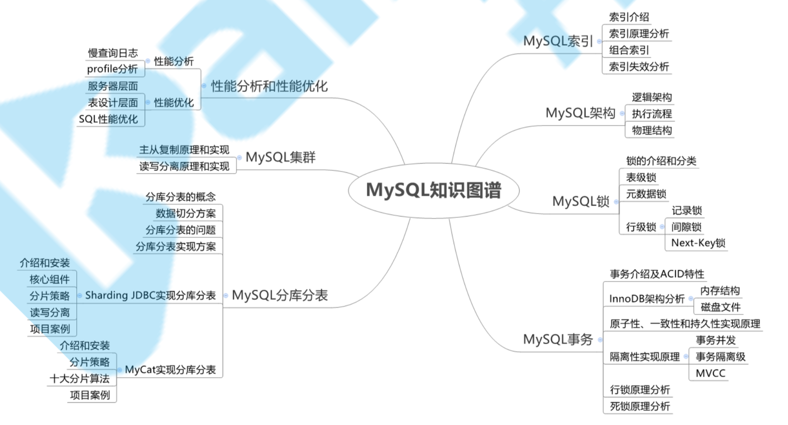

**MySQL知识图谱**

# MySQL架构篇

## 存储引擎
| 存储引擎          | 说明                                                                                                                                     |
| ----------------- | ---------------------------------------------------------------------------------------------------------------------------------------- |
| MyISAM            | 高速引擎，拥有较高的插入，查询速度，但不支持事务、不支持行 锁、支持3种不同的存储格式。包括静态型、动态型和压缩型。                       |
| InnoDB            | 5.5版本后MySQL的默认数据库，支持事务和行级锁定，事务处理、回滚、崩溃修复能力和多版本并发控制的事务安全，比 MyISAM处理速度稍慢、支持外键 |
| ISAM              | MyISAM的前身，MySQL5.0以后不再默认安装                                                                                                   |
| MRG_MyISAM(MERGE) | 将多个表联合成一个表使用，在超大规模数据存储时很有用                                                                                     |
| Memory            | 内存存储引擎，拥有极高的插入，更新和查询效率。但是会占用和 数据量成正比的内存空间。只在内存上保存数据，意味着数据可能 会丢失             |
| Falcon            | 一种新的存储引擎，支持事物处理，传言可能是InnoDB的替代者                                                                                 |
| Archive           | 将数据压缩后进行存储，非常适合存储大量的独立的，作为历史记录的数据，但是只能进行插入和查询操作                                           |
| CSV               | CSV 存储引擎是基于 CSV 格式文件存储数据(应用于跨平台的数据 交换)                                                                         |

- **InnoDB和MyISAM存储引擎区别:**

|          | Innodb                                  | Myisam                                      |
| -------- | --------------------------------------- | ------------------------------------------- |
| 存储文件 | .frm 表定义文件 .ibd 数据文件和索引文件 | .frm 表定义文件 .myd 数据文件 .myi 索引文件 |
| 锁       | 表锁、行锁                              | 表锁                                        |
| 事物     | 支持                                    | 不支持                                      |
| CRUD     | 读、写                                  | 读多                                        |
| count    | 扫表                                    | 专门存储的地方 (加where也扫表)              |
| 索引结构 | B+ Tree                                 | B+ Tree                                     |
| 外键     | 支持                                    | 不支持                                            |

count (*) 找普通索引 ,找到最小的那棵树来遍历 包含空值
count(字段) 走缓存 不包含空值
count(1) 忽略字段 包含空值
