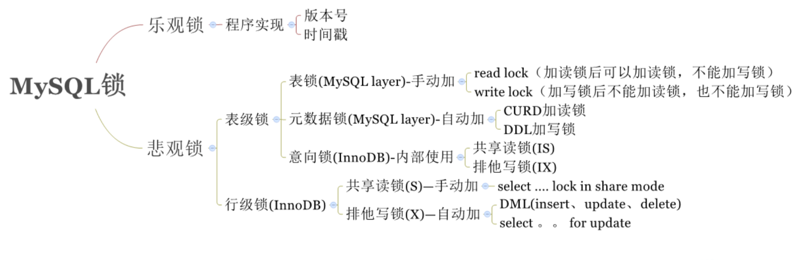

<!-- TOC -->

- [MySQL锁介绍](#mysql%E9%94%81%E4%BB%8B%E7%BB%8D)
- [MySQL表级锁](#mysql%E8%A1%A8%E7%BA%A7%E9%94%81)
  - [表级锁介绍](#%E8%A1%A8%E7%BA%A7%E9%94%81%E4%BB%8B%E7%BB%8D)
  - [表锁介绍](#%E8%A1%A8%E9%94%81%E4%BB%8B%E7%BB%8D)
- [元数据锁](#%E5%85%83%E6%95%B0%E6%8D%AE%E9%94%81)
  - [元数据锁介绍](#%E5%85%83%E6%95%B0%E6%8D%AE%E9%94%81%E4%BB%8B%E7%BB%8D)
- [行级锁](#%E8%A1%8C%E7%BA%A7%E9%94%81)
  - [行级锁介绍](#%E8%A1%8C%E7%BA%A7%E9%94%81%E4%BB%8B%E7%BB%8D)
  - [行级锁分类](#%E8%A1%8C%E7%BA%A7%E9%94%81%E5%88%86%E7%B1%BB)

<!-- /TOC -->
# MySQL锁介绍


# MySQL表级锁
## 表级锁介绍
**由MySQL SQL layer层实现**

- 由MySQL SQL layer层实现
  > 一种是表锁。
  >
  > 一种是元数据锁(meta data lock，MDL)。
- MySQL 实现的表级锁定的争用状态变量:
  > mysql> show status like 'table%';
  > - table_locks_immediate:产生表级锁定的次数;
  > - table_locks_waited:出现表级锁定争用而发生等待的次数;

## 表锁介绍
- 表锁有两种表现形式:
  > 表共享读锁(Table Read Lock)
  >
  > 表独占写锁(Table Write Lock)
- 手动增加表锁
  ```sql
  lock table 表名称 read(write),表名称2 read(write)，其他;
  ```
- 查看表锁情况
  ```sql
  show open tables;
  ```
- 删除表锁
  ```sql
  unlock tables;
  ```

# 元数据锁
## 元数据锁介绍
**MDL (metaDataLock) 元数据: 表结构**

在 MySQL 5.5 版本中引入了 MDL，当对一个表做增删改查操作的时候，加 MDL 读锁;当要对表做结构变更操作的时候，加 MDL 写锁。

# 行级锁
## 行级锁介绍
InnoDB存储引擎实现

InnoDB的行级锁，按照锁定范围来说，分为三种:

- **记录锁(Record Locks)**: 锁定**索引**中一条记录。 主键指定 where id=3
  - **只有主键索引等值会产生记录锁**
- **间隙锁(Gap Locks)**: 锁定记录前、记录中、记录后的行，包括中间的行 RR隔离级 (可重复读)-- MySQL默认隔离级
  - **产生间隙锁的两种情况：**
    - 辅助索引的等值
    - 主键索引的范围
- **Next-Key 锁**: 记录锁 + 间隙锁

InnoDB中产生的都是**Next-Key 锁**

**间隙锁主要是为了防止幻读**

## 行级锁分类
按照功能来说，分为两种:
- 共享读锁(S): 允许一个事务去读一行，阻止其他事务获得相同数据集的排他锁。
  ```sql
  SELECT * FROM table_name WHERE ... LOCK IN SHARE MODE -- 共享读锁 手动添加
  select * from table -- 无锁
  ```
- 排他写锁(X): 允许获得排他写锁的事务更新数据，阻止其他事务取得相同数据集的共享读锁(不是读)和排他写锁。

1. 自动加 DML
   - 对于UPDATE、DELETE和INSERT语句，InnoDB会自动给涉及数据集加排他锁(X);
2. 手动加
   ```sql
   SELECT * FROM table_name WHERE ... FOR UPDATE
   ```

InnoDB也实现了表级锁，也就是意向锁(**意向锁和表锁不是一个意思，表锁是真正的锁表**)，意向锁是mysql内部使用的，不需要用户干预。

- 意向共享锁(IS): 事务打算给数据行加行共享锁，事务在给一个数据行加共享锁前必须先取得该表的IS锁。
- 意向排他锁(IX): 事务打算给数据行加行排他锁，事务在给一个数据行加排他锁前必须先取得该表的IX锁。

意向锁的主要作用是为了【全表更新数据】时的性能提升。否则在全表更新数据时，需要先检索该表是否某些记录上面有行锁。


## 两阶段锁
- 锁操作分为两个阶段:加锁阶段与解锁阶段，
- 加锁阶段与解锁阶段不相交。
- 加锁阶段:只加锁，不放锁。
- 解锁阶段:只放锁，不加锁。

## 行锁使用/演示
**InnoDB行锁是通过给索引上的索引项加锁来实现的，因此InnoDB这种行锁实现特点意味着: 只有通过索引条件检索的数据，InnoDB才使用行级锁，否则，InnoDB将使用表锁!**

where 索引 行锁 否则 表锁

### 间隙锁
**间隙锁防止两种情况**

1. 防止插入间隙内的数据、防止幻读
2. 防止已有数据更新为间隙内的数据

#### 辅助索引等值
**两种情况(边缘数据为记录的上条数据和下条数据，排序后的)：**
- 主键索引在间隙里时，辅助索引的值如果在间隙内(包含边缘数据)，都会阻塞
- 主键索引在间隙外，辅助索引的值在间隙内(不包含下边缘数据)，都会阻塞

#### 主键索引范围
**id无边缘数据，因为主键不能重复**

只要id(在where后面的)在间隙里，则不管辅助索引是多少都会阻塞。

#### 辅助索引无穷大
当一个事物修改/删除数据时，where条件为辅助索引，并且辅助索引的值为当前表里的最大值时，产生的间隙索会无穷大，因为向右由于没有记录因此取得无穷大作为右区间

### 死锁
两个 session 互相等等待对方的资源释放之后，才能释放自己的资源,造成了死锁
