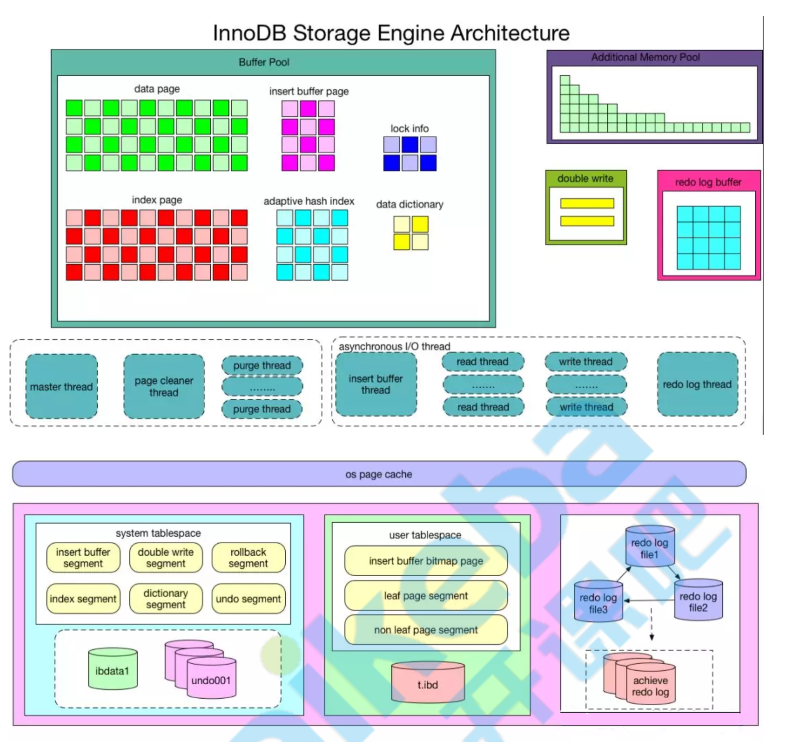

# 事务介绍
> 在MySQL中的事务是由存储引擎实现的，而且支持事务的存储引擎不多，我们主要讲解InnoDB存储引擎中的事务。
>
> 事务处理可以用来维护数据库的完整性，保证成批的 SQL 语句要么全部执行，要么全部不执行。
>
> 事务用来管理 DDL、DML、DCL 操作，比如 insert,update,delete 语句，默认是自动提交的。

# 事务四大特性(ACID)
> - **_Atomicity(原子性)_**: 构成事务的的所有操作必须是一个逻辑单元，要么全部执行，要么全部不执行。
> - **_Consistency(一致性)_**: 数据库在事务执行前后状态都必须是稳定的或者是一致的。
> - **_Isolation(隔离性)_**: 事务之间不会相互影响。
>
>   **_由锁机制和MVCC机制来实现的_**
>
>   **_MVCC(多版本并发控制): 优化读写性能(读不加锁、读写不冲突)_**
> - **_Durability(持久性)_**: 事务执行成功后必须全部写入磁盘。

# InnoDB架构图

# 事务隔离级别
- **四种隔离级别(SQL92标准):**

    现在来看看MySQL数据库为我们提供的四种隔离级别( ):
    1. **Read uncommitted (读未提交)**: 最低级别，任何情况都无法保证。
       - _脏读，读取到未提交的数据_
       - 事物一可以读取到事物二修改的未提交的数据
    2. **Read committed (RC，读已提交)**: 可避免脏读的发生。
       - _幻读，不可重复读取，两次读取的不一样_
       - 事物一可以读取到事物二修改的已提交的数据
    3. **Repeatable read (RR，可重复读)**: 可避免脏读、不可重复读的发生。
       - **(注意事项:InnoDB的RR还可以解决幻读，主要原因是Next-Key(Gap)锁，只有RR才能使用 Next-Key锁)**
       - 事物一不能读取到事物二修改的已提交的数据，永远都是事物开始时的数据
    4. **Serializable (串行化)**: 可避免脏读、不可重复读、幻读的发生。
        - **(由MVCC降级为Locking-Base CC)**

# MVCC
多版本并发控制
> Multiversion concurrency control (MCC or MVCC), is a concurrency control method commonly used by database management systems to provide concurrent access to the database and in programming languages to implement transactional memory.
>
> 多版本并发控制(MCC或MVCC)是一种并发控制方法，通常被数据库管理系统用于提供对数据库的并发访问，并在编程语言中用于实现事务性内存。

## 当前读和快照读
在MVCC并发控制中，读操作可以分成两类:快照读 (snapshot read)与当前读 (current read)。

- **快照读**，读取的是记录的可见版本 (有可能是历史版本)，不用加锁。(select)
- **当前读**，读取的是记录的最新版本，并且当前读返回的记录，都会加上锁，保证其他事务不会再并发修改这条记录。

**在一个支持MVCC并发控制的系统中，哪些读操作是快照读?哪些操作又是当前读呢?**

**以MySQL InnoDB为例:**

1. **快照读:** 简单的select操作，属于快照读，不加锁。(当然，也有例外，下面会分析) 不加读锁 读历史版 本
2. **当前读:** 特殊的读操作，插入/更新/删除操作，属于当前读，需要加锁。 加行写锁 读当前版本

# 事物链表

RC 每个语句
RR 每个事物

# read view

创建时机不一样
