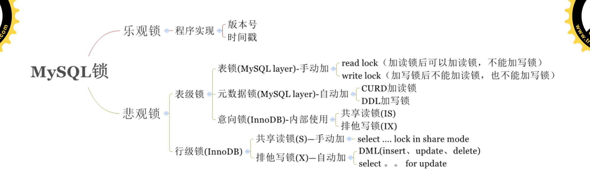

# 索引介绍
## 索引是什么
官方介绍索引是帮助MySQL高效获取数据的数据结构。更通俗的说，数据库索引好比是一本书前面的目录，能加快数据库的查询速度。

## 索引的优势和劣势
### 优势:
- 可以提高数据检索的效率，降低数据库的IO成本，类似于书的目录。 -- 检索
- 通过索引列对数据进行排序，降低数据排序的成本，降低了CPU的消耗。 --排序
  - 被索引的列会自动进行排序，包括【单列索引】和【组合索引】，只是组合索引的排序要复杂一 些。
  - 如果按照索引列的顺序进行排序，对应order by语句来说，效率就会提高很多。
  - where 索引列 在存储引擎层 处理 索引下推 ICP
  - 覆盖索引 select 字段 字段是索引

### 劣势:
- 索引会占据磁盘空间
- 索引虽然会提高查询效率，但是会降低更新表的效率**。比如每次对表进行增删改操作，MySQL不仅要保存数据，还有保存或者更新对应的索引文件。

## 索引分类
- 单列索引
- 组合索引
- 全文索引
- 空间索引
- 位图索引

## 索引原理分析
### 索引存储结构

- 索引是在存储引擎中实现的，也就是说不同的存储引擎，会使用不同的索引
- MyISAM和InnoDB存储引擎:只支持B+ TREE索引， 也就是说默认使用BTREE，不能够更换
- MEMORY/HEAP存储引擎:支持HASH和BTREE索引

一个索引，一个索引树

### B树和B+树
数据结构示例网站:
https://www.cs.usfca.edu/~galles/visualization/Algorithms.html

### 非聚集索引(MyISAM)
索引和数据不在一起(一个文件中，.myd表数据和.myi表索引数据)
不管主键索引还是辅助索引，都是存储的地址信息
主键索引存储主键值，叶子节点存储地址信息

### 聚集索引
索引和数据在一起(一个文件中.ibd)
主键索引，主键索引树叶子节点存储完整数据
辅助索引，辅助索引树叶子节点存储主键值

### 回表
从辅助索引树上找到主键后在主键索引树下找到数据

### 覆盖索引
在一棵索引树上，查找到相关数据，不需要再去回表，就叫做覆盖索引
利用组合索引完成在辅助索引树的遍历，不回表

## 组合索引
优势: 效率高、省空间、容易形成覆盖索引

### 使用
1. 前缀索引
   - like 常量% 使用索引 like %常量 不使用索引
2. 最左前缀
   - 从左向右匹配直到遇到范围查询 > < between 索引失效

## 索引失效
未整理

### 索引失效分析
1. 全值匹配我最爱
2. 最佳左前缀法则
   - 带头索引不能死，中间索引不能断
3. 不要在索引上做计算
   - 不要进行这些操作:计算、函数、自动/手动类型转换，不然会导致索引失效而转向全表扫描
4. 范围条件右边的列失效
5. 尽量使用覆盖索引
   - 尽量使用覆盖索引(只查询索引的列)，也就是索引列和查询列一致，减少select *
6. 索引字段上不要使用不等
   - 索引字段上使用(!= 或者 < >)判断时，会导致索引失效而转向全表扫描 注:主键索引会使用范围索引，辅助索引会失效
7. 主键索引字段上不可以判断null
   - 索引字段上使用 is null 判断时，可使用索引
8. 索引字段使用like不以通配符开头
   - 索引字段使用like以通配符开头(‘%字符串’)时，会导致索引失效而转向全表扫描
   - 解决like ‘%字符串%’时，索引失效问题的方法? 使用覆盖索引可以解决
9. 索引字段字符串要加单引号
   - 索引字段是字符串，但查询时不加单引号，会导致索引失效而转向全表扫描
10. 索引字段不要使用or
    - 索引字段使用 or 时，会导致索引失效而转向全表扫描

锁

**MySQL锁**

# MVCC

 乐关锁
> 程序实现
- 版本号
- 时间缀

## 悲观锁
### 表级锁
MySQL的表级锁有两种

> 一种是表锁。
> 一种是元数据锁(meta data lock，MDL)。
